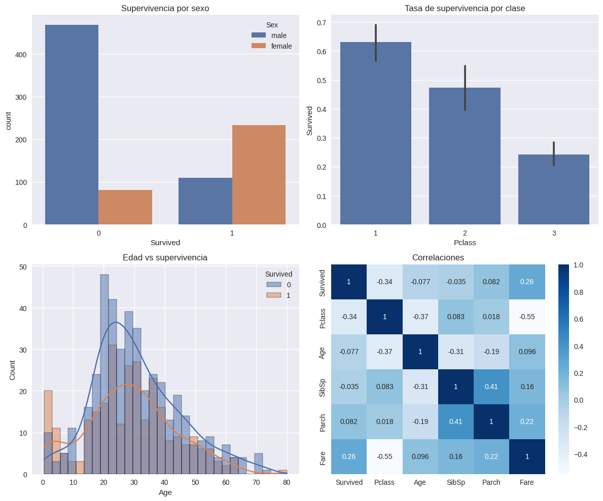

# Práctica 1 — EDA del Titanic en Google Colab

- Link al proyecto en Colab: [Practica1.ipynb](https://colab.research.google.com/drive/1QKzwbxGR3xPZEOOXgEBbacLxBBXo876Z?usp=sharing)

## Contexto

Análisis exploratorio del dataset del Titanic usando Google Colab y librerías de Python. El objetivo es comprender la estructura de los datos y explorar factores que influyen en la supervivencia.

## Objetivos

- Investigar el dataset del Titanic y sus atributos.
- Realizar un EDA visual y estadístico.
- Identificar variables relevantes y problemas de calidad de datos.

## Actividades (con tiempos estimados)

| Actividad                 | Tiempo | Resultado esperado                 |
| ------------------------- | :----: | ---------------------------------- |
| Investigación del dataset |  10m   | Resumen y descripción de atributos |
| Setup en Colab            |   5m   | Entorno listo y carpetas creadas   |
| Carga de datos            |  10m   | Datos disponibles en DataFrame     |
| EDA estadístico y visual  |  15m   | Gráficos y análisis inicial        |

## Desarrollo

### 0. Investigación del Dataset del Titanic

El dataset del Titanic es uno de los conjuntos de datos más famosos en ciencia de datos, utilizado en la competencia de Kaggle para predecir la supervivencia de los pasajeros. El objetivo es construir un modelo que, a partir de los atributos disponibles, prediga si un pasajero sobrevivió o no al naufragio.

**Atributos principales:**

- `PassengerId`: Identificador único de pasajero.
- `Survived`: Variable objetivo (0 = no sobrevivió, 1 = sobrevivió).
- `Pclass`: Clase del ticket (1, 2, 3).
- `Name`: Nombre completo.
- `Sex`: Sexo.
- `Age`: Edad.
- `SibSp`: Número de hermanos/cónyuges a bordo.
- `Parch`: Número de padres/hijos a bordo.
- `Ticket`: Número de ticket.
- `Fare`: Tarifa pagada.
- `Cabin`: Cabina asignada.
- `Embarked`: Puerto de embarque (C = Cherbourg, Q = Queenstown, S = Southampton).

**Preguntas de investigación:**

- ¿Qué factores influyeron más en la supervivencia?: Clase del billete, sexo, edad y puerto de embarque.
- ¿Qué desafíos de calidad de datos existen?: Valores faltantes (edad, camarote, embarque), datos inconsistentes o mal tipados.
- ¿Qué variables podrían estar correlacionadas?: Clase con tarifa, clase con camarote, miembros familiares con supervivencia.

### 1. Setup en Colab

```python
import pandas as pd
import numpy as np
import matplotlib.pyplot as plt
import seaborn as sns
import warnings
warnings.filterwarnings('ignore')

plt.style.use('seaborn-v0_8')
sns.set_palette('deep')

from pathlib import Path
try:
    from google.colab import drive
    drive.mount('/content/drive')
    ROOT = Path('/content/drive/MyDrive/IA-UT1')
except Exception:
    ROOT = Path.cwd() / 'IA-UT1'

DATA_DIR = ROOT / 'data'
RESULTS_DIR = ROOT / 'results'
for d in (DATA_DIR, RESULTS_DIR):
    d.mkdir(parents=True, exist_ok=True)
print('Outputs →', ROOT)
```

**Salida:**

```text
Drive already mounted at /content/drive; to attempt to forcibly remount, call drive.mount("/content/drive", force_remount=True).
Outputs → /content/drive/MyDrive/IA-UT1
```

### 2. Cargar el dataset de Kaggle

```python
!pip -q install kaggle
from google.colab import files
files.upload()  # Subí tu archivo kaggle.json descargado
!mkdir -p ~/.kaggle && cp kaggle.json ~/.kaggle/ && chmod 600 ~/.kaggle/kaggle.json
!kaggle competitions download -c titanic -p data
!unzip -o data/titanic.zip -d data

train = pd.read_csv('data/train.csv')
test = pd.read_csv('data/test.csv')
```

**Salida:**

```text
Ningún archivo seleccionado Upload widget is only available when the cell has been executed en la sesión actual.
Saving kaggle.json to kaggle (2).json
titanic.zip: Skipping, found more recently modified local copy (use --force to force download)
Archive:  data/titanic.zip
  inflating: data/gender_submission.csv
  inflating: data/test.csv
  inflating: data/train.csv
```

### 3. Conocer el dataset

```python
train.shape, train.columns
train.info()
train.describe(include='all').T
train.isna().sum().sort_values(ascending=False)
train['Survived'].value_counts(normalize=True)
```

**Salida:**

```text
<class 'pandas.core.frame.DataFrame'>
RangeIndex: 891 entries, 0 to 890
Data columns (total 12 columns):
 #   Column       Non-Null Count  Dtype
---  ------       --------------  -----
 0   PassengerId  891 non-null    int64
 1   Survived     891 non-null    int64
 2   Pclass       891 non-null    int64
 3   Name         891 non-null    object
 4   Sex          891 non-null    object
 5   Age          714 non-null    float64
 6   SibSp        891 non-null    int64
 7   Parch        891 non-null    int64
 8   Ticket       891 non-null    object
 9   Fare         891 non-null    float64
 10  Cabin        204 non-null    object
 11  Embarked     889 non-null    object
dtypes: float64(2), int64(5), object(5)
memory usage: 83.7+ KB

Survived
0	0.616162
1	0.383838
dtype: float64
```

### 4. EDA visual con seaborn/matplotlib

```python
fig, axes = plt.subplots(2, 2, figsize=(12, 10))

# Supervivencia global por sexo
sns.countplot(data=train, x='Survived', hue='Sex', ax=axes[0,0])
axes[0,0].set_title('Supervivencia por sexo')

# Tasa de supervivencia por clase
sns.barplot(data=train, x='Pclass', y='Survived', estimator=np.mean, ax=axes[0,1])
axes[0,1].set_title('Tasa de supervivencia por clase')

# Distribución de edad por supervivencia
sns.histplot(data=train, x='Age', hue='Survived', kde=True, bins=30, ax=axes[1,0])
axes[1,0].set_title('Edad vs supervivencia')

# Correlaciones numéricas
numeric_cols = ['Survived', 'Pclass', 'Age', 'SibSp', 'Parch', 'Fare']
sns.heatmap(train[numeric_cols].corr(), annot=True, cmap='Blues', ax=axes[1,1])
axes[1,1].set_title('Correlaciones')

plt.tight_layout()
plt.show()
```

**Evidencias:**



### Reflexión

Observando la matriz de correlación y los gráficos, `Pclass` y `Fare` parecen tener una correlación significativa con la supervivencia. Las mujeres tienen una mayor tasa de supervivencia que los hombres, y los pasajeros de primera clase tienen una tasa de supervivencia considerablemente mayor que los de tercera.

Las columnas con más valores faltantes son `Cabin`, `Age` y `Embarked`.

- **Cabin:** Dado el alto porcentaje de valores faltantes (casi el 77%), imputar esta columna podría no ser la mejor opción. Podríamos considerar eliminarla o crear una nueva variable binaria indicando si la cabina es conocida o no.
- **Age:** Se podría imputar con la mediana o media de la edad, o utilizar métodos más sofisticados como la imputación por regresión o k-NN.
- **Embarked:** Solo tiene dos valores faltantes, por lo que se podría imputar con el valor más frecuente (moda).

**Hipótesis a probar:**

- Si la edad influye en la supervivencia dentro de cada clase de pasajero.
- Si el puerto de embarque tuvo un impacto en la tasa de supervivencia.
- Si el número de hermanos/cónyuges (`SibSp`) o padres/hijos (`Parch`) a bordo influye en la supervivencia.
- Si el título en el nombre (Mr., Mrs., Miss., etc.) se relaciona con la supervivencia y si puede ser un mejor predictor que el sexo por sí solo.

## Referencias

- [Descripción del dataset y competencia en Kaggle](https://www.kaggle.com/competitions/titanic/data)
- Ejemplos de notebooks públicos en Kaggle
