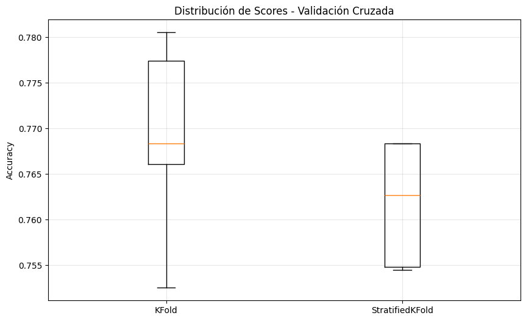
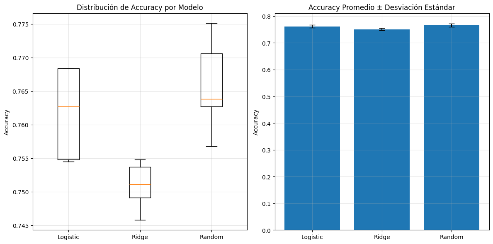
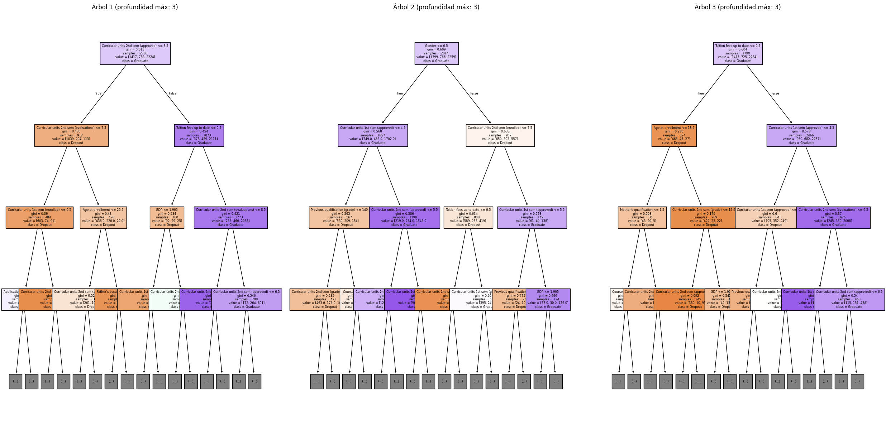

# Práctica 5 — Validación y Selección de Modelos

## Contexto

Práctica guiada sobre validación cruzada, comparación de modelos y explicabilidad usando el dataset "Student Dropout and Academic Success" de UCI. El objetivo es prevenir data leakage, comparar modelos robustamente y entender las decisiones del modelo.

## Objetivos

- Prevenir data leakage usando pipelines.
- Implementar validación cruzada robusta (KFold y StratifiedKFold).
- Comparar múltiples modelos y analizar estabilidad.
- Interpretar métricas y explicar decisiones del modelo.

## Actividades (con tiempos estimados)

| Actividad                     | Tiempo | Resultado esperado                        |
| ----------------------------- | :----: | ----------------------------------------- |
| Setup y exploración           |  10m   | Datos cargados y explorados               |
| Validación cruzada            |  20m   | Scores y comparación de métodos           |
| Competencia de modelos        |  20m   | Comparación y selección del mejor         |
| Optimización y explicabilidad |  20m   | Hiperparámetros y análisis de importancia |
| Reflexión                     |  10m   | Respuestas y recomendaciones              |

## Desarrollo

### Paso 1: Setup y exploración de datos

```python
!pip install ucimlrepo

import pandas as pd
import numpy as np
import matplotlib.pyplot as plt

from sklearn.linear_model import LogisticRegression, RidgeClassifier
from sklearn.ensemble import RandomForestClassifier
from sklearn.model_selection import train_test_split, cross_val_score, KFold, StratifiedKFold
from sklearn.preprocessing import StandardScaler
from sklearn.pipeline import Pipeline
from ucimlrepo import fetch_ucirepo
from sklearn.metrics import accuracy_score, classification_report

print("Setup completo!")

student_data = fetch_ucirepo(id=697)
X = student_data.data.features
y = student_data.data.targets

print("Dataset: Student Dropout and Academic Success")
print(f"Estudiantes: {X.shape[0]}, Características: {X.shape[1]}")
print(f"Objetivo: Predecir {len(y.columns)} variable(s)")

target_col = y.columns[0]
y_series = y[target_col]
target_mapping = {0: 'Dropout', 1: 'Enrolled', 2: 'Graduate'}
y_mapped = y_series.map(target_mapping)

print("\nDistribución de resultados académicos:")
value_counts = y_mapped.value_counts()
for outcome, count in value_counts.items():
    percentage = (count / len(y_mapped)) * 100
    print(f"  {outcome}: {count} estudiantes ({percentage:.1f}%)")

print(f"\nPrimeras características:")
print(X.columns.tolist()[:10], "...")

if 'Age at enrollment' in X.columns:
    age_col = X['Age at enrollment']
    print(f"  Promedio: {age_col.mean():.1f} años")
    print(f"  Rango: {age_col.min():.0f}-{age_col.max():.0f} años")
```

**Salida:**

```text
Dataset: Student Dropout and Academic Success
Estudiantes: 4424, Características: 36
Objetivo: Predecir 1 variable(s)

Variable objetivo: Target

Distribución de resultados académicos:
...

Primeras características:
['Marital Status', 'Application mode', ...]
Age at enrollment:
  Promedio: 23.3 años
  Rango: 17-70 años
```

### Paso 2: Preparar datos para validación

```python
reverse_mapping = {'Dropout': 0, 'Enrolled': 1, 'Graduate': 2}
if y_series.dtype == 'object':
    y_target = y_series.map(reverse_mapping)
else:
    y_target = y_series

X_features = X

print("Datos preparados para validación:")
print(f"X shape: {X_features.shape}")
print(f"y shape: {y_target.shape}")
print(f"Clases únicas: {sorted(y_target.unique())}")
print(f"Mapeo: {target_mapping}")
```

**Salida:**

```text
X shape: (4424, 36)
y shape: (4424,)
Clases únicas: [0, 1, 2]
Mapeo: {0: 'Dropout', 1: 'Enrolled', 2: 'Graduate'}
```

### Paso 3: Validación cruzada robusta

```python
pipeline_robust = Pipeline([
    ('scaler', StandardScaler()),
    ('classifier', LogisticRegression(max_iter=1000, random_state=42))
])

kfold = KFold(n_splits=5, shuffle=True, random_state=42)
scores_kfold = cross_val_score(
    pipeline_robust, X_features, y_target, cv=kfold, scoring='accuracy'
)

stratified_kfold = StratifiedKFold(n_splits=5, shuffle=True, random_state=42)
scores_stratified = cross_val_score(
    pipeline_robust, X_features, y_target, cv=stratified_kfold, scoring='accuracy'
)

print(f"\nKFOLD RESULTS: {scores_kfold.mean():.4f} ± {scores_kfold.std():.4f}")
print(f"STRATIFIED KFOLD RESULTS: {scores_stratified.mean():.4f} ± {scores_stratified.std():.4f}")

plt.figure(figsize=(10, 6))
plt.boxplot([scores_kfold, scores_stratified], labels=['KFold', 'StratifiedKFold'])
plt.title('Distribución de Scores - Validación Cruzada')
plt.ylabel('Accuracy')
plt.grid(True, alpha=0.3)
plt.show()
```

**Evidencia:**



### Paso 4: Competencia de modelos

```python
models = {
    'Logistic Regression': Pipeline([
        ('scaler', StandardScaler()),
        ('classifier', LogisticRegression(max_iter=1000, random_state=42))
    ]),
    'Ridge Classifier': Pipeline([
        ('scaler', StandardScaler()),
        ('classifier', RidgeClassifier(alpha=1.0, random_state=42))
    ]),
    'Random Forest': Pipeline([
        ('classifier', RandomForestClassifier(n_estimators=100, random_state=42))
    ])
}

results = {}
for name, model in models.items():
    scores = cross_val_score(
        model, X_features, y_target,
        cv=StratifiedKFold(n_splits=5, shuffle=True, random_state=42),
        scoring='accuracy'
    )
    results[name] = scores
    print(f"{name}: {scores.mean():.4f} ± {scores.std():.4f}")

best_mean_score = 0
best_model_name = ""
for name, scores in results.items():
    if scores.mean() > best_mean_score:
        best_mean_score = scores.mean()
        best_model_name = name

print(f"GANADOR: {best_model_name}")
print(f"Score: {best_mean_score:.4f}")

plt.figure(figsize=(12, 6))
plt.subplot(1, 2, 1)
plt.boxplot([results[name] for name in models.keys()],
           labels=[name.split()[0] for name in models.keys()])
plt.title('Distribución de Accuracy por Modelo')
plt.ylabel('Accuracy')
plt.grid(True, alpha=0.3)

plt.subplot(1, 2, 2)
names = list(models.keys())
means = [results[name].mean() for name in names]
stds = [results[name].std() for name in names]
plt.bar(range(len(names)), means, yerr=stds, capsize=5)
plt.xticks(range(len(names)), [name.split()[0] for name in names])
plt.title('Accuracy Promedio ± Desviación Estándar')
plt.ylabel('Accuracy')
plt.grid(True, alpha=0.3)
plt.tight_layout()
plt.show()
```

**Evidencia:**



### Paso 5: Optimización de hiperparámetros

```python
from sklearn.model_selection import GridSearchCV, RandomizedSearchCV

best_model_base = models[best_model_name]
if 'Random Forest' in best_model_name:
    param_grid = {
        'classifier__n_estimators': [50, 100, 200],
        'classifier__max_depth': [None, 10, 20, 30],
        'classifier__min_samples_split': [2, 5, 10]
    }
elif 'Logistic' in best_model_name:
    param_grid = {
        'classifier__C': [0.1, 1, 10, 100],
        'classifier__max_iter': [1000, 2000]
    }
else:
    param_grid = {
        'classifier__alpha': [0.1, 1, 10, 100]
    }

grid_search = GridSearchCV(
    best_model_base,
    param_grid,
    cv=5,
    scoring='accuracy',
    n_jobs=-1,
    verbose=1
)
grid_search.fit(X_features, y_target)
print(f"Mejores parámetros (Grid): {grid_search.best_params_}")
print(f"Mejor score (Grid): {grid_search.best_score_:.4f}")

random_search = RandomizedSearchCV(
    best_model_base,
    param_grid,
    n_iter=20,
    cv=5,
    scoring='accuracy',
    n_jobs=-1,
    random_state=42,
    verbose=1
)
random_search.fit(X_features, y_target)
print(f"Mejores parámetros (Random): {random_search.best_params_}")
print(f"Mejor score (Random): {random_search.best_score_:.4f}")

final_model = grid_search.best_estimator_
final_scores = cross_val_score(final_model, X_features, y_target, cv=5)
print(f"\nModelo final optimizado: {final_scores.mean():.4f} ± {final_scores.std():.4f}")
```

### Paso 6: Explicabilidad del modelo

```python
if 'Random Forest' not in best_model_name:
    rf_model = Pipeline([
        ('classifier', RandomForestClassifier(n_estimators=100, random_state=42))
    ])
    rf_model.fit(X_features, y_target)
else:
    rf_model = final_model

feature_names = X_features.columns
importances = rf_model.named_steps['classifier'].feature_importances_
feature_importance_df = pd.DataFrame({
    'feature': feature_names,
    'importance': importances
}).sort_values('importance', ascending=False)

print("\nTOP 10 CARACTERÍSTICAS MÁS IMPORTANTES:")
for i, row in feature_importance_df.head(10).iterrows():
    print(f"{row['feature']}: {row['importance']:.4f}")

plt.figure(figsize=(10, 8))
top_features = feature_importance_df.head(15)
plt.barh(range(len(top_features)), top_features['importance'])
plt.yticks(range(len(top_features)), top_features['feature'])
plt.xlabel('Importancia')
plt.title('Top 15 Características Más Importantes para Predecir Éxito Estudiantil')
plt.gca().invert_yaxis()
plt.tight_layout()
plt.show()
```

**Evidencia:**


#### Visualización de árboles individuales

```python
from sklearn.tree import plot_tree

forest = rf_model.named_steps['classifier']
n_trees_to_show = min(3, len(forest.estimators_))
fig, axes = plt.subplots(1, n_trees_to_show, figsize=(25, 12))
for i in range(n_trees_to_show):
    tree = forest.estimators_[i]
    plot_tree(tree,
              ax=axes[i],
              feature_names=list(feature_names),
              class_names=['Dropout', 'Enrolled', 'Graduate'],
              filled=True,
              max_depth=3,
              fontsize=6)
    axes[i].set_title(f'Árbol {i+1} (profundidad máx: 3)', fontsize=12)
plt.tight_layout()
plt.show()
```

**Evidencia:**



---

## Evidencias

- Distribución de scores por KFold y StratifiedKFold.
- Comparación de accuracy y estabilidad entre modelos.
- Optimización de hiperparámetros con GridSearchCV y RandomizedSearchCV.
- Importancia de características y visualización de árboles.

## Reflexión

- **Data leakage:** Es cuando el modelo accede a información del futuro o de los datos de prueba durante el entrenamiento. Es peligroso porque da una falsa sensación de buen rendimiento y falla en datos reales.
- **KFold vs StratifiedKFold:** KFold para clases balanceadas; StratifiedKFold para clases desbalanceadas, mantiene proporción de clases en cada fold.
- **Interpretar "95.2% ± 2.1%" en cross-validation:** 95.2% es el accuracy promedio esperado en datos nuevos; ±2.1% es la variabilidad entre folds (mide estabilidad).
- **Random Forest y StandardScaler:** Random Forest no necesita escalado porque los árboles dividen datos por umbrales, no por distancias.
- **Estabilidad vs rendimiento:** En diagnóstico médico, prefiero un modelo estable (95% accuracy muy estable) que uno inestable con mayor accuracy.

## Referencias

- [Student Dropout and Academic Success Dataset](https://archive.ics.uci.edu/ml/datasets/Student+Dropout+and+Academic+Success)
- [Scikit-learn User Guide](https://scikit-learn.org/stable/user_guide.html)
- [GridSearchCV](https://scikit-learn.org/stable/modules/generated/sklearn.model_selection.GridSearchCV.html)
- [RandomizedSearchCV](https://scikit-learn.org/stable/modules/generated/sklearn.model_selection.RandomizedSearchCV.html)
