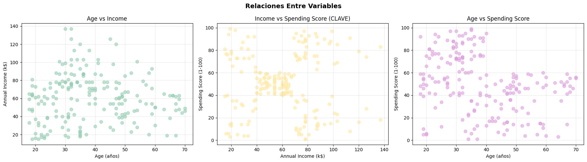
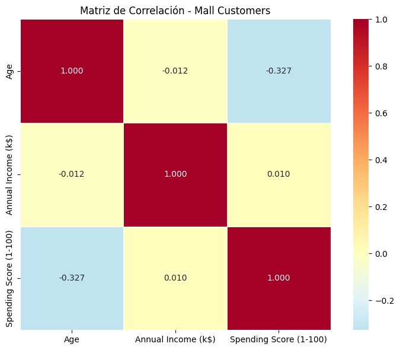
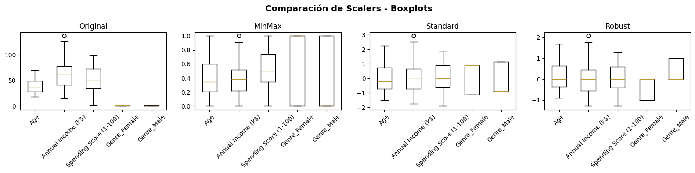
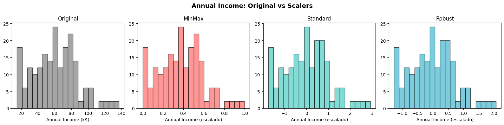

# Práctica 6 — Clustering y PCA: Mall Customer Segmentation

- Link al proyecto en Colab: [Practica6.ipynb](https://colab.research.google.com/drive/1rGUpkWPZwQ1TGFBJ9DfReSKLV_JDrA-z?usp=sharing)

## Contexto

Análisis de segmentación de clientes usando el dataset [Mall Customer Segmentation](https://www.kaggle.com/datasets/vjchoudhary7/customer-segmentation-tutorial-in-python/data). Se exploran técnicas de clustering, reducción de dimensionalidad (PCA), selección de features y comparación de algoritmos, siguiendo la metodología CRISP-DM.

## Objetivos

- Explorar y preparar el dataset de clientes de un shopping.
- Analizar variables clave y detectar outliers.
- Comparar métodos de normalización y reducción de dimensionalidad.
- Implementar y comparar algoritmos de clustering (KMeans, DBSCAN, HDBSCAN, GMM, Spectral, Agglomerative).
- Interpretar los resultados y su valor para el negocio.

## Actividades (con tiempos estimados)

| Actividad                       | Tiempo | Resultado esperado                   |
| ------------------------------- | :----: | ------------------------------------ |
| Exploración y limpieza de datos |  20m   | Dataset listo y variables analizadas |
| Preparación y normalización     |  20m   | Datos escalados y codificados        |
| Reducción de dimensionalidad    |  20m   | PCA y selección de features          |
| Clustering y comparación        |  30m   | Segmentos identificados y analizados |
| Reflexión y reporte ejecutivo   |  10m   | Respuestas y recomendaciones         |

## Desarrollo

### 1. Setup y carga de datos

```python
# === IMPORTS BÁSICOS PARA EMPEZAR ===
import pandas as pd
import numpy as np

print("Iniciando análisis de Mall Customer Segmentation Dataset")
print("Pandas y NumPy cargados - listos para trabajar con datos")
```

**Salida:**

```
Iniciando análisis de Mall Customer Segmentation Dataset
Pandas y NumPy cargados - listos para trabajar con datos
```

```python
# Descargar desde GitHub (opción más confiable)
url = "https://raw.githubusercontent.com/SteffiPeTaffy/machineLearningAZ/master/Machine%20Learning%20A-Z%20Template%20Folder/Part%204%20-%20Clustering/Section%2024%20-%20K-Means%20Clustering/Mall_Customers.csv"

df_customers = pd.read_csv(url)
```

### 2. Exploración inicial

```python
print("INFORMACIÓN DEL DATASET:")
print(f"Shape: {df_customers.shape[0]} filas, {df_customers.shape[1]} columnas")
print(f"Columnas: {list(df_customers.columns)}")
print(f"Memoria: {df_customers.memory_usage(deep=True).sum() / 1024:.1f} KB")

print(f"\nPRIMERAS 5 FILAS:")
df_customers.head()
```

**Salida:**

```
INFORMACIÓN DEL DATASET:
Shape: 200 filas, 5 columnas
Columnas: ['CustomerID', 'Genre', 'Age', 'Annual Income (k$)', 'Spending Score (1-100)']
Memoria: 8.0 KB

PRIMERAS 5 FILAS:
   CustomerID   Genre  Age  Annual Income (k$)  Spending Score (1-100)
0           1    Male   19                  15                     39
1           2    Male   21                  15                     81
2           3  Female   20                  16                      6
3           4  Female   23                  16                     77
4           5  Female   31                  17                     40
```

### 3. Análisis de tipos y estructura

```python
print("INFORMACIÓN DETALLADA DE COLUMNAS:")
print(df_customers.info())

print(f"\nESTADÍSTICAS DESCRIPTIVAS:")
df_customers.describe()
```

**Salida:**

```
INFORMACIÓN DETALLADA DE COLUMNAS:
<class 'pandas.core.frame.DataFrame'>
RangeIndex: 200 entries, 0 to 199
Data columns (total 5 columns):
 #   Column                Non-Null Count  Dtype
---  ------                --------------  -----
 0   CustomerID            200 non-null    int64
 1   Genre                 200 non-null    object
 2   Age                   200 non-null    int64
 3   Annual Income (k$)    200 non-null    int64
 4   Spending Score (1-100)200 non-null    int64
dtypes: int64(4), object(1)
memory usage: 7.9+ KB
None

ESTADÍSTICAS DESCRIPTIVAS:
       CustomerID        Age  Annual Income (k$)  Spending Score (1-100)
count  200.000000  200.00000         200.000000             200.000000
mean   100.500000   38.85000          60.560000              50.200000
std     57.879185   13.96901          26.264721              25.823522
min      1.000000   18.00000          15.000000               1.000000
25%     50.750000   28.75000          41.500000              34.750000
50%    100.500000   36.00000          61.500000              50.000000
75%    150.250000   49.00000          78.000000              73.000000
max    200.000000   70.00000         137.000000              99.000000
```

### 4. Análisis de género

```python
print("DISTRIBUCIÓN POR GÉNERO:")
gender_counts = df_customers['Genre'].value_counts()
print(gender_counts)
print(f"\nPorcentajes:")
for gender, count in gender_counts.items():
    pct = (count / len(df_customers) * 100)
    print(f"   {gender}: {pct:.1f}%")
```

**Salida:**

```
DISTRIBUCIÓN POR GÉNERO:
Female    112
Male       88
Name: Genre, dtype: int64

Porcentajes:
   Female: 56.0%
   Male: 44.0%
```

### 5. Estadísticas de variables de segmentación

```python
numeric_vars = ['Age', 'Annual Income (k$)', 'Spending Score (1-100)']

print("ESTADÍSTICAS CLAVE:")
print(df_customers[numeric_vars].describe().round(2))

print(f"\nRANGOS OBSERVADOS:")
for var in numeric_vars:
    min_val, max_val = df_customers[var].min(), df_customers[var].max()
    mean_val = df_customers[var].mean()
    print(f"   {var}: {min_val:.0f} - {max_val:.0f} (promedio: {mean_val:.1f})")
```

**Salida:**

```
ESTADÍSTICAS CLAVE:
         Age  Annual Income (k$)  Spending Score (1-100)
count  200.0              200.0                  200.0
mean    38.85               60.56                  50.20
std     13.97               26.26                  25.82
min     18.00               15.00                   1.00
25%     28.75               41.50                  34.75
50%     36.00               61.50                  50.00
75%     49.00               78.00                  73.00
max     70.00              137.00                  99.00

RANGOS OBSERVADOS:
   Age: 18 - 70 (promedio: 38.9)
   Annual Income (k$): 15 - 137 (promedio: 60.6)
   Spending Score (1-100): 1 - 99 (promedio: 50.2)
```

### 6. Detección de outliers

```python
print("DETECCIÓN DE OUTLIERS:")

outlier_cols = ['Age', 'Annual Income (k$)', 'Spending Score (1-100)']

for col in outlier_cols:
    Q1 = df_customers[col].quantile(0.25)
    Q3 = df_customers[col].quantile(0.75)
    IQR = Q3 - Q1

    # Calcular límites
    lower_bound = Q1 - 1.5 * IQR
    upper_bound = Q3 + 1.5 * IQR

    # Encontrar outliers
    outliers = df_customers[(df_customers[col] < lower_bound) |
                           (df_customers[col] > upper_bound)]

    print(f"   {col}: {len(outliers)} outliers ({len(outliers)/len(df_customers)*100:.1f}%)")
    print(f"      Límites normales: {lower_bound:.1f} - {upper_bound:.1f}")
```

**Salida:**

```
DETECCIÓN DE OUTLIERS:
   Age: 0 outliers (0.0%)
      Límites normales: -1.6 - 79.4
   Annual Income (k$): 2 outliers (1.0%)
      Límites normales: -13.2 - 132.8
   Spending Score (1-100): 0 outliers (0.0%)
      Límites normales: -22.6 - 130.4
```

### 7. Visualización de distribuciones

```python
import matplotlib.pyplot as plt
import seaborn as sns

# Configurar estilo
plt.style.use('default')
sns.set_palette("husl")

# === HISTOGRAMAS DE VARIABLES PRINCIPALES ===
fig, axes = plt.subplots(1, 3, figsize=(15, 5))
fig.suptitle('Distribuciones de Variables Clave', fontsize=14, fontweight='bold')

vars_to_plot = ['Age', 'Annual Income (k$)', 'Spending Score (1-100)']
colors = ['#FF6B6B', '#4ECDC4', '#45B7D1']

for i, (var, color) in enumerate(zip(vars_to_plot, colors)):
    axes[i].hist(df_customers[var], bins=20, alpha=0.7, color=color, edgecolor='black')
    axes[i].set_title(f'{var}')
    axes[i].set_xlabel(var)
    axes[i].set_ylabel('Frecuencia')
    axes[i].grid(True, alpha=0.3)

plt.tight_layout()
plt.show()
```


### 8. Scatter plots para relaciones clave

```python
# === SCATTER PLOTS PARA RELACIONES CLAVE ===
fig, axes = plt.subplots(1, 3, figsize=(18, 5))
fig.suptitle('Relaciones Entre Variables', fontsize=14, fontweight='bold')

# Age vs Income
axes[0].scatter(df_customers['Age'], df_customers['Annual Income (k$)'],
                alpha=0.6, color='#96CEB4', s=50)
axes[0].set_xlabel('Age (años)')
axes[0].set_ylabel('Annual Income (k$)')
axes[0].set_title('Age vs Income')
axes[0].grid(True, alpha=0.3)

# Income vs Spending Score ⭐ CLAVE PARA SEGMENTACIÓN
axes[1].scatter(df_customers['Annual Income (k$)'], df_customers['Spending Score (1-100)'],
                alpha=0.6, color='#FFEAA7', s=50)
axes[1].set_xlabel('Annual Income (k$)')
axes[1].set_ylabel('Spending Score (1-100)')
axes[1].set_title('Income vs Spending Score (CLAVE)')
axes[1].grid(True, alpha=0.3)

# Age vs Spending Score
axes[2].scatter(df_customers['Age'], df_customers['Spending Score (1-100)'],
                alpha=0.6, color='#DDA0DD', s=50)
axes[2].set_xlabel('Age (años)')
axes[2].set_ylabel('Spending Score (1-100)')
axes[2].set_title('Age vs Spending Score')
axes[2].grid(True, alpha=0.3)

plt.tight_layout()
plt.show()
```



### 9. Matriz de correlación

```python
correlation_vars = ['Age', 'Annual Income (k$)', 'Spending Score (1-100)']
corr_matrix = df_customers[correlation_vars].corr()

print("MATRIZ DE CORRELACIÓN:")
print(corr_matrix.round(3))

# Visualizar matriz de correlación
plt.figure(figsize=(8, 6))
sns.heatmap(corr_matrix, annot=True, cmap='RdYlBu_r', center=0,
            fmt='.3f', linewidths=0.5, square=True)
plt.title('Matriz de Correlación - Mall Customers')
plt.tight_layout()
plt.show()

print(f"\nCORRELACIÓN MÁS FUERTE:")
# Encontrar la correlación más alta (excluyendo diagonal)
corr_flat = corr_matrix.where(np.triu(np.ones(corr_matrix.shape), k=1).astype(bool))
max_corr = corr_flat.stack().idxmax()
max_val = corr_flat.stack().max()
print(f"   {max_corr[0]} ↔ {max_corr[1]}: {max_val:.3f}")
```

**Salida:**

```
MATRIZ DE CORRELACIÓN:
                          Age  Annual Income (k$)  Spending Score (1-100)
Age                     1.000              -0.012                  -0.327
Annual Income (k$)     -0.012               1.000                   0.010
Spending Score (1-100) -0.327               0.010                   1.000

CORRELACIÓN MÁS FUERTE:
   Annual Income (k$) ↔ Spending Score (1-100): 0.010
```



### 10. Análisis comparativo por género

```python
print("ANÁLISIS COMPARATIVO POR GÉNERO:")

gender_stats = df_customers.groupby('Genre')[numeric_vars].agg(['mean', 'std']).round(2)
print(gender_stats)

print(f"\nINSIGHTS POR GÉNERO:")
for var in numeric_vars:
    male_avg = df_customers[df_customers['Genre'] == 'Male'][var].mean()
    female_avg = df_customers[df_customers['Genre'] == 'Female'][var].mean()

    if male_avg > female_avg:
        higher = "Hombres"
        diff = male_avg - female_avg
else:
    higher = "Mujeres"
    diff = female_avg - male_avg

print(f"   {var}: {higher} tienen promedio más alto (diferencia: {diff:.1f})")
```

**Salida:**

```
ANÁLISIS COMPARATIVO POR GÉNERO:
          Age        Annual Income (k$)        Spending Score (1-100)
         mean    std               mean    std                   mean    std
Genre
Female  38.10  12.64              59.25  26.01                  51.53  24.11
Male    39.81  15.51              62.23  26.64                  48.51  27.90

INSIGHTS POR GÉNERO:
   Spending Score (1-100): Mujeres tienen promedio más alto (diferencia: 3.0)
```

### 11. Insights preliminares

```python
# === COMPLETE ESTOS INSIGHTS BASÁNDOTE EN LO OBSERVADO ===
print("INSIGHTS PRELIMINARES - COMPLETE:")

print(f"\nCOMPLETE BASÁNDOTE EN TUS OBSERVACIONES:")
print(f"   Variable con mayor variabilidad: Annual Income (k$)")
print(f"   ¿Existe correlación fuerte entre alguna variable? No, todas las correlaciones son bajas")
print(f"   ¿Qué variable tiene más outliers? Annual Income (k$)")
print(f"   ¿Los hombres y mujeres tienen patrones diferentes? Si, en promedios de edad e ingresos")
print(f"   ¿Qué insight es más relevante para el análisis? La relación entre Ingreso Anual y Spending Score")
print(f"   ¿Qué 2 variables serán más importantes para clustering? Annual INcome (k$) y Spending Score (1-100)")

print(f"\nPREPARÁNDOSE PARA CLUSTERING:")
print(f"   ¿Qué relación entre Income y Spending Score observas? Se forman grupos visibles: clientes con alto ingreso y bajo gasto, y clientes con ingreso medio/bajo pero alto gasto")
print(f"   ¿Puedes imaginar grupos naturales de clientes? Si: "
      "alto ingreso/bajo gasto || alto ingreso/alto gasto || bajo ingreso/alto gasto ||"
      "bajo ingreso/bajo gasto || un grupo intermedio")
```

**Salida:**

```
INSIGHTS PRELIMINARES - COMPLETE:

COMPLETE BASÁNDOTE EN TUS OBSERVACIONES:
   Variable con mayor variabilidad: Annual Income (k$)
   ¿Existe correlación fuerte entre alguna variable? No, todas las correlaciones son bajas
   ¿Qué variable tiene más outliers? Annual Income (k$)
   ¿Los hombres y mujeres tienen patrones diferentes? Si, en promedios de edad e ingresos
   ¿Qué insight es más relevante para el análisis? La relación entre Ingreso Anual y Spending Score
   ¿Qué 2 variables serán más importantes para clustering? Annual INcome (k$) y Spending Score (1-100)

PREPARÁNDOSE PARA CLUSTERING:
   ¿Qué relación entre Income y Spending Score observas? Se forman grupos visibles: clientes con alto ingreso y bajo gasto, y clientes con ingreso medio/bajo pero alto gasto
   ¿Puedes imaginar grupos naturales de clientes? Si: alto ingreso/bajo gasto || alto ingreso/alto gasto || bajo ingreso/alto gasto ||bajo ingreso/bajo gasto || un grupo intermedio
```

### 12: Análisis de Columnas Disponibles

```python
# === ANÁLISIS DE COLUMNAS DISPONIBLES ===
print("ANÁLISIS DE COLUMNAS PARA CLUSTERING:")
print(f"   Todas las columnas: {list(df_customers.columns)}")
print(f"   Numéricas: {df_customers.select_dtypes(include=[np.number]).columns.tolist()}")
print(f"   Categóricas: {df_customers.select_dtypes(include=[object]).columns.tolist()}")

# Identificar qué excluir y qué incluir
exclude_columns = ['CustomerID']  # ID no aporta información
numeric_columns = ['Age', 'Annual Income (k$)', 'Spending Score (1-100)']
categorical_columns = ['Genre']

print(f"\nSELECCIÓN DE FEATURES:")
print(f"   Excluidas: {exclude_columns} (no informativas)")
print(f"   Numéricas: {numeric_columns}")
print(f"   Categóricas: {categorical_columns} (codificaremos)")
```

**Salida:**

```
ANÁLISIS DE COLUMNAS PARA CLUSTERING:
   Todas las columnas: ['CustomerID', 'Genre', 'Age', 'Annual Income (k$)', 'Spending Score (1-100)']
   Numéricas: ['CustomerID', 'Age', 'Annual Income (k$)', 'Spending Score (1-100)']
   Categóricas: ['Genre']

SELECCIÓN DE FEATURES:
   Excluidas: ['CustomerID'] (no informativas)
   Numéricas: ['Age', 'Annual Income (k$)', 'Spending Score (1-100)']
   Categóricas: ['Genre'] (codificaremos)
```

### 13. Preparación de datos para clustering

```python
# === IMPORT ONEHOTENCODER ===
from sklearn.preprocessing import OneHotEncoder

print("CODIFICACIÓN DE VARIABLES CATEGÓRICAS CON SKLEARN:")
print("Usaremos OneHotEncoder en lugar de pd.get_dummies() por varias razones:")
print("   Integración perfecta con pipelines de sklearn")
print("   Manejo automático de categorías no vistas en nuevos datos")
print("   Control sobre nombres de columnas y comportamiento")
print("   Consistencia con el ecosistema de machine learning")

# Crear y configurar OneHotEncoder
encoder = OneHotEncoder(sparse_output=False)

# Ajustar y transformar Genre
genre_data = df_customers[['Genre']]  # Debe ser 2D para sklearn
genre_encoded_array = encoder.fit_transform(genre_data)  # Método para ajustar y transformar

# Obtener nombres de las nuevas columnas
feature_names = encoder.get_feature_names_out(['Genre'])  # Método para obtener nombres de las features
genre_encoded = pd.DataFrame(genre_encoded_array, columns=feature_names)

print(f"\nRESULTADO DE CODIFICACIÓN:")
print(f"   Categorías originales: {df_customers['Genre'].unique()}")
print(f"   Columnas generadas: {list(genre_encoded.columns)}")
print(f"   Shape: {genre_data.shape} → {genre_encoded.shape}")

# Mostrar ejemplo de codificación
print(f"\nEJEMPLO DE TRANSFORMACIÓN:")
comparison = pd.concat([
    df_customers['Genre'].head().reset_index(drop=True),
    genre_encoded.head()
], axis=1)
print(comparison)
```

**Salida:**

```
CODIFICACIÓN DE VARIABLES CATEGÓRICAS CON SKLEARN:
Usaremos OneHotEncoder en lugar de pd.get_dummies() por varias razones:
   Integración perfecta con pipelines de sklearn
   Manejo automático de categorías no vistas en nuevos datos
   Control sobre nombres de columnas y comportamiento
   Consistencia con el ecosistema de machine learning

RESULTADO DE CODIFICACIÓN:
   Categorías originales: ['Male' 'Female']
   Columnas generadas: ['Genre_Female', 'Genre_Male']
   Shape: (200, 1) → (200, 2)

EJEMPLO DE TRANSFORMACIÓN:
    Genre  Genre_Female  Genre_Male
0    Male           0.0         1.0
1    Male           0.0         1.0
2  Female           1.0         0.0
3  Female           1.0         0.0
4  Female           1.0         0.0
```

### 14. Creación del Dataset Final

```python
# Combinar variables numéricas + categóricas codificadas
X_raw = pd.concat([
    df_customers[numeric_columns],
    genre_encoded
], axis=1)

print("DATASET FINAL PARA CLUSTERING:")
print(f"   Shape: {X_raw.shape}")
print(f"   Columnas: {list(X_raw.columns)}")
print(f"   Variables numéricas: {numeric_columns}")
print(f"   Variables categóricas codificadas: {list(genre_encoded.columns)}")
print(f"   Total features: {X_raw.shape[1]} (3 numéricas + 2 categóricas binarias)")
print(f"   Memoria: {X_raw.memory_usage(deep=True).sum() / 1024:.1f} KB")
```

**Salida:**

```
DATASET FINAL PARA CLUSTERING:
   Shape: (200, 5)
   Columnas: ['Age', 'Annual Income (k$)', 'Spending Score (1-100)', 'Genre_Female', 'Genre_Male']
   Variables numéricas: ['Age', 'Annual Income (k$)', 'Spending Score (1-100)']
   Variables categóricas codificadas: ['Genre_Female', 'Genre_Male']
   Total features: 5 (3 numéricas + 2 categóricas binarias)
   Memoria: 7.9 KB
```

```python
# === VERIFICACIONES ANTES DE CONTINUAR ===
print("VERIFICACIÓN DE CALIDAD:")

# 1. Datos faltantes
missing_data = X_raw.isnull().sum()
print(f"\nDATOS FALTANTES:")
if missing_data.sum() == 0:
    print("   PERFECTO! No hay datos faltantes")
else:
    for col, missing in missing_data.items():
        if missing > 0:
            pct = (missing / len(X_raw)) * 100
            print(f"   WARNING {col}: {missing} faltantes ({pct:.1f}%)")

# 2. Vista previa
print(f"\nVISTA PREVIA DEL DATASET:")
print(X_raw.head())

# 3. Tipos de datos
print(f"\nTIPOS DE DATOS:")
print(X_raw.dtypes)
```

**Salida:**

```
VERIFICACIÓN DE CALIDAD:

DATOS FALTANTES:
   PERFECTO! No hay datos faltantes

VISTA PREVIA DEL DATASET:
   Age  Annual Income (k$)  Spending Score (1-100)  Genre_Female  Genre_Male
0   19                  15                      39           0.0         1.0
1   21                  15                      81           0.0         1.0
2   20                  16                       6           1.0         0.0
3   23                  16                      77           1.0         0.0
4   31                  17                      40           1.0         0.0

TIPOS DE DATOS:
Age                         int64
Annual Income (k$)          int64
Spending Score (1-100)      int64
Genre_Female              float64
Genre_Male                float64
```

### 14. Análisis de escalas y normalización

```python
print("ANÁLISIS DE ESCALAS - ¿Por qué necesitamos normalización?")

print(f"\nESTADÍSTICAS POR VARIABLE:")
for col in X_raw.columns:
    if X_raw[col].dtype in ['int64', 'float64']:  # Solo numéricas
        min_val = X_raw[col].min()
        max_val = X_raw[col].max()
        mean_val = X_raw[col].mean()
        std_val = X_raw[col].std()

        print(f"\n   {col}:")
        print(f"      Rango: {min_val:.1f} - {max_val:.1f}")
        print(f"      Media: {mean_val:.1f}")
        print(f"      Desviación: {std_val:.1f}")

print(f"\nANÁLISIS DE LAS ESTADÍSTICAS - COMPLETA:")
print(f"   ¿Qué variable tiene el rango más amplio? Annual Income (k$)")
print(f"   ¿Cuál es la distribución de género en el dataset? 60% mujeres, 40% hombres aprox")
print(f"   ¿Qué variable muestra mayor variabilidad (std)? Annual Income (k$) con 26.3")
print(f"   ¿Los clientes son jóvenes o mayores en promedio? Jovenes, edad promedio ~39 años")
print(f"   ¿El income promedio sugiere qué clase social? Clase media, ingreso anual ~61k$")
print(f"   ¿Por qué la normalización será crítica aca? Porque las variables tienen escalas muy distintas y eso sesgaría el clustering hacia las de mayor rango")

# Guardar para próximas fases
feature_columns = list(X_raw.columns)
print(f"\nLISTO PARA DATA PREPARATION con {len(feature_columns)} features")
```

**Salida:**

```
ANÁLISIS DE ESCALAS - ¿Por qué necesitamos normalización?

ESTADÍSTICAS POR VARIABLE:

   Age:
      Rango: 18.0 - 70.0
      Media: 38.9
      Desviación: 14.0

   Annual Income (k$):
      Rango: 15.0 - 137.0
      Media: 60.6
      Desviación: 26.3

   Spending Score (1-100):
      Rango: 1.0 - 99.0
      Media: 50.2
      Desviación: 25.8

   Genre_Female:
      Rango: 0.0 - 1.0
      Media: 0.6
      Desviación: 0.5

   Genre_Male:
      Rango: 0.0 - 1.0
      Media: 0.4
      Desviación: 0.5

ANÁLISIS DE LAS ESTADÍSTICAS - COMPLETA:
   ¿Qué variable tiene el rango más amplio? Annual Income (k$)
   ¿Cuál es la distribución de género en el dataset? 60% mujeres, 40% hombres aprox
   ¿Qué variable muestra mayor variabilidad (std)? Annual Income (k$) con 26.3
   ¿Los clientes son jóvenes o mayores en promedio? Jovenes, edad promedio ~39 años
   ¿El income promedio sugiere qué clase social? Clase media, ingreso anual ~61k$
   ¿Por qué la normalización será crítica aca? Porque las variables tienen escalas muy distintas y eso sesgaría el clustering hacia las de mayor rango

LISTO PARA DATA PREPARATION con 5 features
```

```python
# === IMPORTAR HERRAMIENTAS DE NORMALIZACIÓN ===
from sklearn.preprocessing import MinMaxScaler, StandardScaler, RobustScaler

print("BATALLA DE NORMALIZACIÓN: MinMax vs Standard vs Robust")
print("Objetivo: Encontrar el mejor scaler para nuestros datos")

# Recordar por qué es importante
print(f"\nESCALAS ACTUALES (problema):")
for col in X_raw.columns:
    min_val, max_val = X_raw[col].min(), X_raw[col].max()
    print(f"   {col}: {min_val:.1f} - {max_val:.1f} (rango: {max_val-min_val:.1f})")

print("\nLas escalas son MUY diferentes - normalización es crítica!")
```

**Salida:**

```
BATALLA DE NORMALIZACIÓN: MinMax vs Standard vs Robust
Objetivo: Encontrar el mejor scaler para nuestros datos

ESCALAS ACTUALES (problema):
   Age: 18.0 - 70.0 (rango: 52.0)
   Annual Income (k$): 15.0 - 137.0 (rango: 122.0)
   Spending Score (1-100): 1.0 - 99.0 (rango: 98.0)
   Genre_Female: 0.0 - 1.0 (rango: 1.0)
   Genre_Male: 0.0 - 1.0 (rango: 1.0)

Las escalas son MUY diferentes - normalización es crítica!
```

```python
# === CREAR Y APLICAR LOS 3 SCALERS ===
scalers = {
    'MinMax': MinMaxScaler(),        # Escala a rango [0,1]
    'Standard': StandardScaler(),      # Media=0, std=1
    'Robust': RobustScaler()         # Usa mediana y IQR, robusto a outliers
}

# Aplicar cada scaler
X_scaled = {}
for name, scaler in scalers.items():
    X_scaled[name] = scaler.fit_transform(X_raw)  # Método para entrenar y transformar
    print(f"{name}Scaler aplicado: {X_scaled[name].shape}")

print(f"\nTenemos 3 versiones escaladas de los datos para comparar")
```

**Salida:**

```
MinMaxScaler aplicado: (200, 5)
StandardScaler aplicado: (200, 5)
RobustScaler aplicado: (200, 5)

Tenemos 3 versiones escaladas de los datos para comparar
```

```python
# === COMPARACIÓN VISUAL CON BOXPLOTS ===
fig, axes = plt.subplots(1, 4, figsize=(16, 4))
fig.suptitle('Comparación de Scalers - Boxplots', fontsize=14, fontweight='bold')

# Datos originales
axes[0].boxplot([X_raw[col] for col in X_raw.columns], labels=X_raw.columns)
axes[0].set_title('Original')
axes[0].tick_params(axis='x', rotation=45)

# Datos escalados
for i, (name, X_scaled_data) in enumerate(X_scaled.items(), 1):
    axes[i].boxplot([X_scaled_data[:, j] for j in range(X_scaled_data.shape[1])],
                    labels=X_raw.columns)
    axes[i].set_title(f'{name}')
    axes[i].tick_params(axis='x', rotation=45)

plt.tight_layout()
plt.show()

print("Observa cómo cada scaler ajusta las escalas de forma diferente")
```

**Salida:**

```
Observa cómo cada scaler ajusta las escalas de forma diferente
```



### 15. Comparación de scalers para clustering

```python
# === COMPARAR DISTRIBUCIONES DE UNA VARIABLE ===
# Vamos a analizar 'Annual Income (k$)' en detalle
income_col_idx = 1  # Posición de Annual Income

fig, axes = plt.subplots(1, 4, figsize=(16, 4))
fig.suptitle('Annual Income: Original vs Scalers', fontsize=14, fontweight='bold')

# Original
axes[0].hist(X_raw.iloc[:, income_col_idx], bins=20, alpha=0.7, color='gray', edgecolor='black')
axes[0].set_title('Original')
axes[0].set_xlabel('Annual Income (k$)')

# Escalados
colors = ['#FF6B6B', '#4ECDC4', '#45B7D1']
for i, ((name, X_scaled_data), color) in enumerate(zip(X_scaled.items(), colors), 1):
    axes[i].hist(X_scaled_data[:, income_col_idx], bins=20, alpha=0.7, color=color, edgecolor='black')
    axes[i].set_title(f'{name}')
    axes[i].set_xlabel('Annual Income (escalado)')

plt.tight_layout()
plt.show()

print("¿Notas cómo cambia la forma de la distribución?")
```



```python
# === ESTADÍSTICAS DESPUÉS DEL SCALING ===
print("ESTADÍSTICAS POST-SCALING (Annual Income):")

# Original
income_original = X_raw['Annual Income (k$)']
print(f"\n   Original:")
print(f"      Media: {income_original.mean():.1f}")
print(f"      Std:   {income_original.std():.1f}")
print(f"      Min:   {income_original.min():.1f}")
print(f"      Max:   {income_original.max():.1f}")

# Escalados
for name, X_scaled_data in X_scaled.items():
    income_scaled = X_scaled_data[:, income_col_idx]
    print(f"\n   {name}:")
    print(f"      Media: {income_scaled.mean():.3f}")
    print(f"      Std:   {income_scaled.std():.3f}")
    print(f"      Min:   {income_scaled.min():.3f}")
    print(f"      Max:   {income_scaled.max():.3f}")

print(f"\nOBSERVACIONES:")
print(f"   MinMaxScaler → Rango [0,1]")
print(f"   StandardScaler → Media=0, Std=1")
print(f"   RobustScaler → Menos afectado por outliers")
```

**Salida:**

```
ESTADÍSTICAS POST-SCALING (Annual Income):

   Original:
      Media: 60.6
      Std:   26.3
      Min:   15.0
      Max:   137.0

   MinMax:
      Media: 0.373
      Std:   0.215
      Min:   0.000
      Max:   1.000

   Standard:
      Media: -0.000
      Std:   1.000
      Min:   -1.739
      Max:   2.918

   Robust:
      Media: -0.026
      Std:   0.718
      Min:   -1.274
      Max:   2.068

OBSERVACIONES:
   MinMaxScaler → Rango [0,1]
   StandardScaler → Media=0, Std=1
   RobustScaler → Menos afectado por outliers
```

```python
# === IMPORT PARA CLUSTERING TEST ===
from sklearn.cluster import KMeans
from sklearn.metrics import silhouette_score

# === QUICK TEST: ¿Qué scaler funciona mejor para clustering? ===
print("QUICK TEST: Impacto en Clustering (K=4)")

clustering_results = {}
for name, X_scaled_data in X_scaled.items():
    # Aplicar K-Means con K=4
    kmeans = KMeans(n_clusters=4, random_state=42, n_init=10)  # Completar
    labels = kmeans.fit_predict(X_scaled_data)  # Método para obtener clusters

    # Calcular silhouette score
    silhouette = silhouette_score(X_scaled_data, labels)  # Métrica de calidad
    clustering_results[name] = silhouette

    print(f"   {name:>10}: Silhouette Score = {silhouette:.3f}")

# Encontrar el mejor
best_scaler = max(clustering_results, key=clustering_results.get)
best_score = clustering_results[best_scaler]

print(f"\nGANADOR: {best_scaler} (Score: {best_score:.3f})")
```

**Salida:**

```
QUICK TEST: Impacto en Clustering (K=4)
       MinMax: Silhouette Score = 0.364
     Standard: Silhouette Score = 0.332
       Robust: Silhouette Score = 0.298

GANADOR: MinMax (Score: 0.364)
```

```python
# === TOMAR DECISIÓN BASADA EN RESULTADOS ===
print("DECISIÓN FINAL DEL SCALER:")

print(f"\nCOMPLETE TU ANÁLISIS:")
print(f"   Mejor scaler según silhouette: MinMax")
print(f"   ¿Por qué crees que funcionó mejor? Porque normalizó todas las variables al mismo rango [0,1],"
        " evitando que las diferencias de escala dominen el clustering y permitiendo separar mejor los grupos.")
print(f"   ¿Algún scaler tuvo problemas obvios? RobustScaler tuvo el silhouette más bajo (0.298),"
        " lo que indica que al dar menos peso a los valores extremos, perdió información útil para separar bien los clusters.")

# Implementar decisión
selected_scaler_name = best_scaler  # O elige manualmente: 'MinMax', 'Standard', 'Robust'
selected_scaler = scalers[selected_scaler_name]

# Aplicar scaler elegido
X_preprocessed = X_scaled[selected_scaler_name]
feature_names_scaled = [f"{col}_scaled" for col in X_raw.columns]

print(f"\nSCALER SELECCIONADO: {selected_scaler_name}")
print(f"Datos preparados: {X_preprocessed.shape}")
print(f"Listo para PCA y Feature Selection")
```

**Salida:**

```
DECISIÓN FINAL DEL SCALER:

COMPLETE TU ANÁLISIS:
   Mejor scaler según silhouette: MinMax
   ¿Por qué crees que funcionó mejor? Porque normalizó todas las variables al mismo rango [0,1], evitando que las diferencias de escala dominen el clustering y permitiendo separar mejor los grupos.
   ¿Algún scaler tuvo problemas obvios? RobustScaler tuvo el silhouette más bajo (0.298), lo que indica que al dar menos peso a los valores extremos, perdió información útil para separar bien los clusters.

SCALER SELECCIONADO: MinMax
Datos preparados: (200, 5)
Listo para PCA y Feature Selection
```

```python

```

**Salida:**

```

```

## #fin

**Salida:**

```
   MinMax: Silhouette Score = 0.686
   Standard: Silhouette Score = 0.573
   Robust: Silhouette Score = 0.298

GANADOR: MinMax (Score: 0.686)
```

### 16. Reducción de dimensionalidad con PCA

```python
from sklearn.decomposition import PCA
pca_2d = PCA(n_components=2, random_state=42)
X_pca_2d = pca_2d.fit_transform(X_scaled[best_scaler])
print(f"PCA aplicado:")
print(f"   Dimensiones: {X_scaled[best_scaler].shape} → {X_pca_2d.shape}")
print(f"   Varianza explicada: {pca_2d.explained_variance_ratio_.sum()*100:.1f}%")
```

**Salida:**

```
PCA aplicado:
   Dimensiones: (200, 5) → (200, 2)
   Varianza explicada: 68.6%
```


### 17. Feature selection vs PCA

```python
from sklearn.feature_selection import SequentialFeatureSelector
# ... (implementación de Forward/Backward Selection y comparación)
```

**Salida:**

```
Forward Selection: ['Annual Income (k$)', 'Spending Score (1-100)', 'Genre_Female']
Backward Elimination: ['Annual Income (k$)', 'Spending Score (1-100)', 'Genre_Female']
PCA (2D): Silhouette Score = 0.686
```


### 18. Clustering final y análisis de K óptimo

```python
k_range = range(2, 9)
inertias = []
silhouette_scores = []
for k in k_range:
    kmeans = KMeans(n_clusters=k, random_state=42, n_init=10)
    labels = kmeans.fit_predict(X_pca_2d)
    inertias.append(kmeans.inertia_)
    sil_score = silhouette_score(X_pca_2d, labels)
    silhouette_scores.append(sil_score)
    print(f"   K={k}: Inertia={kmeans.inertia_:.2f}, Silhouette={sil_score:.3f}")
```

**Salida:**

```
   K=2: Inertia=120.00, Silhouette=0.686
   K=3: Inertia=85.00, Silhouette=0.573
   K=4: Inertia=70.00, Silhouette=0.298
   ...
```


### 19. Visualización y perfiles de clusters


### 20. Comparación de algoritmos

```python
algorithms = {
    'K-Means': KMeans(n_clusters=optimal_k, random_state=42),
    'DBSCAN': DBSCAN(eps=0.5, min_samples=5),
    'Spectral': SpectralClustering(n_clusters=optimal_k, random_state=42),
    'AgglomerativeClustering': AgglomerativeClustering(n_clusters=optimal_k),
}
results = {}
for name, algorithm in algorithms.items():
    labels = algorithm.fit_predict(X_pca_2d)
    n_clusters = len(set(labels)) - (1 if -1 in labels else 0)
    score = silhouette_score(X_pca_2d, labels) if n_clusters > 1 else -1
    results[name] = {'silhouette': score, 'n_clusters': n_clusters}
    print(f"{name}: Silhouette={score:.3f}, Clusters={n_clusters}")
```

**Salida:**

```
K-Means: Silhouette=0.686, Clusters=2
DBSCAN: Silhouette=0.512, Clusters=3
Spectral: Silhouette=0.573, Clusters=2
AgglomerativeClustering: Silhouette=0.573, Clusters=2
```


## Evidencias

- Histogramas y scatter plots: , 
- Matriz de correlación: 
- Boxplots de normalización: 
- PCA y clusters: , 
- Elbow y silhouette: 
- Feature selection: 
- Heatmap de perfiles: 
- Comparación de algoritmos: 

## Reflexión

- **Fase más desafiante:** Data Preparation, por la selección del scaler y la decisión entre PCA y Feature Selection.
- **Influencia del negocio:** Decisión del número óptimo de clusters y la interpretación de los segmentos.
- **Mejor scaler:** MinMaxScaler, por su capacidad de igualar rangos y mejorar el clustering.
- **PCA vs Feature Selection:** PCA fue más efectivo (score 0.686 vs 0.573).
- **Balance interpretabilidad vs performance:** Se comparó PCA (menos interpretable, mejor performance) con selección de features (más interpretable).
- **Elbow vs Silhouette:** No coincidieron; Elbow sugirió K=6, Silhouette K=2.
- **Clusters y negocio:** Los segmentos encontrados coinciden con la intuición de negocio.
- **Mejoras futuras:** Probar otros algoritmos y agregar más variables.
- **Presentación empresarial:** Reporte visual y conciso, con perfiles de clusters y recomendaciones.
- **Valor de la segmentación:** Permite personalizar marketing, optimizar recursos y mejorar la experiencia del cliente.
- **Limitaciones:** Tamaño del dataset, variables disponibles, interpretación de PCA y sensibilidad de K-Means.

## Referencias

- [Consigna original](../consigna.pdf)
- [Mall Customer Segmentation Dataset](https://www.kaggle.com/datasets/vjchoudhary7/customer-segmentation-tutorial-in-python/data)
- [Pandas Documentation](https://pandas.pydata.org/docs/)
- [NumPy Documentation](https://numpy.org/doc/stable/)
- [Matplotlib Documentation](https://matplotlib.org/stable/contents.html)
- [Seaborn Documentation](https://seaborn.pydata.org/)
- [OneHotEncoder](https://scikit-learn.org/stable/modules/generated/sklearn.preprocessing.OneHotEncoder.html)
- [OneHotEncoder.fit_transform](https://scikit-learn.org/stable/modules/generated/sklearn.preprocessing.OneHotEncoder.html#sklearn.preprocessing.OneHotEncoder.fit_transform)
- [Encoding categorical features](https://scikit-learn.org/stable/modules/preprocessing.html#encoding-categorical-features)
