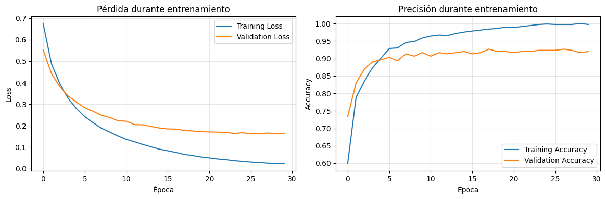

# Del perceptrón al XOR: cómo una MLP resuelve lo que una línea no puede

- Consigna: [consigna](https://juanfkurucz.com/ucu-ia/ut2/07-mlp-activaciones/)
- Trabajo realizado (notebook): [ut2_1.ipynb](https://colab.research.google.com/drive/1NPGgMzgl8e7EUiPCilazXewmog_ZgWkS?usp=sharing)

## Contexto

En esta práctica se recorre el camino **de perceptrón simple a redes multicapa (MLP)** para comprender por qué problemas como **XOR** no pueden resolverse con una sola frontera lineal y cómo una **MLP** (y luego **TensorFlow** y **PyTorch Lightning**) superan esa limitación con **capas ocultas** y **no linealidades**. La guía de trabajo define hitos claros: lógicas AND/OR/NOT, visualización de fronteras, demostración de imposibilidad en XOR y resolución con MLP y frameworks modernos.

## Objetivos

- **Evidenciar la limitación del perceptrón** en problemas no linealmente separables (XOR).
- **Resolver XOR** con una red multicapa de tamaño mínimo efectivo.
- **Comparar herramientas**: `sklearn` MLP, `TensorFlow/Keras` y `PyTorch Lightning`.
- **Analizar resultados y sobreajuste** con curvas de aprendizaje y matrices de confusión.
- **Reflexionar** sobre cuándo elegir cada enfoque en un flujo estilo **CRISP‑DM** (entender, preparar, modelar, evaluar, aprender).

## Actividades

1. **Perceptrón**: AND, OR y NOT funcionan; se visualiza la **línea** de decisión.
2. **XOR**: múltiples intentos fallidos muestran la **imposibilidad** con una sola línea.
3. **MLP (sklearn)**: una arquitectura **2→4→1** resuelve XOR (accuracy 100% en ese set).
4. **Problema sintético realista**: MLP **64‑32 ReLU** logra **~100% train / ~90% test**.
5. **TensorFlow/Keras**: red **64‑32‑1** con `sigmoid` en salida; se plotéan **curvas de loss/accuracy**.
6. **PyTorch Lightning (bonus)**: entrenamiento determinístico, evaluación y **matriz de confusión**.

## Desarrollo y decisiones

### 1) Perceptrón: lo que puede (y lo que no)

- **AND** con pesos simétricos y **bias** más estricto.
- **NOT** en 1D con **peso negativo + bias positivo**.
- **XOR**: se muestran **cuatro configuraciones** de línea; ninguna separa correctamente los cuatro puntos.
- Decisión: **priorizar explicaciones y visualizaciones** por encima de bloques de código extensos (feedback aplicado).

**Evidencias:**

- 
- 
- 

### 2) MLP con `sklearn`: mínima que resuelve XOR

- Configuración efectiva: **`hidden_layer_sizes=(4,)`**, activación **`tanh`**.
- Resultado: **100%** de acierto en XOR; la **superficie curva** separa correctamente.

**Evidencia:**

- 
- 

### 3) Dataset sintético “realista” y generalización

- Dataset: `make_classification(n_samples=1000, n_features=20, …)`
- MLP: **64‑32**, activación **ReLU**, `solver='adam'`.
- Métricas reportadas: **Train ≈ 100.0%**, **Test ≈ 90.3%**.
- Nota: se sugiere complementar con **`classification_report`** para `precision/recall/F1` por clase.

**Evidencia:**

- 

### 4) Red “profesional” en **TensorFlow/Keras**

- Arquitectura: **64‑32‑1**, activaciones `relu`/`relu`/`sigmoid`.
- `optimizer='adam'`, `loss='binary_crossentropy'`.
- Entrenamiento con **epochs** y **batch_size**; se grafican **loss/val_loss** y **acc/val_acc** para observar convergencia y posible **overfitting**.

### 5) **PyTorch Lightning** (bonus)

- Módulo `LightningModule` con `SimpleNet` y `Adam`.
- Entrenamiento determinístico (`deterministic=True`), `DataLoader` con batches.
- Evaluación con `trainer.test()` y visualización comparativa de **matrices de confusión**.

## Matrices de Confusión

- 

## Resultados (tabla breve)

| Escenario                          | Modelo/Framework              | Arquitectura          | Métricas clave                   |
| ---------------------------------- | ----------------------------- | --------------------- | -------------------------------- |
| Lógicas AND/OR/NOT                 | Perceptrón                    | 2→1 (o 1→1)           | Separación **lineal**: **OK**    |
| XOR                                | Perceptrón                    | 2→1                   | **Imposible** (no lineal)        |
| XOR                                | `sklearn` MLP                 | **2→4→1**             | **100%** (set XOR)               |
| Clasificación sintética (20 feats) | `sklearn` MLP                 | **20→64→32→1**        | **Train ~100% / Test ~90.3%**    |
| Clasificación sintética (20 feats) | **TensorFlow/Keras**          | **20→64→32→1**        | Accuracy comparable (según runs) |
| Clasificación sintética (20 feats) | **PyTorch Lightning** (BONUS) | 20→64→32→2 (CrossEnt) | Métricas comparables             |

> **Lectura:** el salto clave es **introducir una capa oculta** (y activación no lineal): eso crea **superficies curvas** que sí separan XOR. En problemas reales, la red más profunda permite **representaciones** más ricas y suele generalizar mejor con regularización y validación adecuadas.

## Reflexión (qué aprendí y cuándo usar cada cosa)

- **Perceptrón**: rápido para **líneas** (y planos) pero insuficiente para datos con fronteras complejas (XOR, círculos, lunas).
- **`sklearn` MLP**: ideal para **prototipado rápido**; define arquitectura y entrena “de una” sin gestionar loops de batches.
- **TensorFlow/Keras**: control total del **proceso de entrenamiento**, necesario para **experimentos** y despliegues con seguimiento fino (callbacks, regularización, serving).
- **PyTorch Lightning**: reduce boilerplate, facilita **reproducibilidad** y **experimentos**, manteniendo flexibilidad de PyTorch.
- **Buenas prácticas aplicadas**: menos código en el informe, más **visualizaciones** y **explicaciones**; títulos más **narrativos** y orientados a **problema** (feedback incorporado).

**Próximos pasos**

- Añadir **`classification_report`** completo.
- Sustituir matrices “típicas” por matrices **reales** de cada framework.
- Probar datasets no lineales (e.g., `make_moons`, `make_circles`) para profundizar en superficies de decisión.
- Explorar **regularización** (p.ej., `dropout`, `l2`) y **paradas tempranas**.

## Referencias

- **Consigna UT2 – Práctica 7** (marco, actividades y referencias adjuntas).
