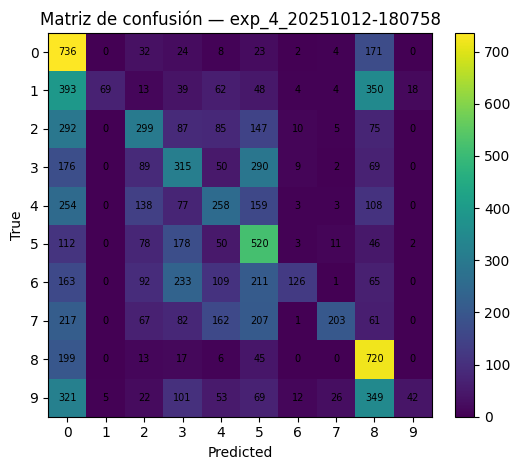

# Del MLP al rendimiento: qué mejora la generalización en CIFAR‑10

- Consigna: [consigna](https://juanfkurucz.com/ucu-ia/ut2/08-backpropagation-optimizadores/)
- Trabajo realizado (notebook): [ut2_2.ipynb](https://colab.research.google.com/drive/1lqYALJrxnAeFa8-VkJg_lW5yLYg4A2hX?usp=sharing)

## Contexto

Entrené y comparé MLPs sobre CIFAR‑10 para entender qué combinaciones de arquitectura, activación, regularización, optimizador y callbacks mejoran la generalización. Registrando todo en TensorBoard para analizar convergencia, overfitting y estabilidad.

## Objetivos

- Comparar optimizadores (Adam, SGD, AdamW, RMSprop) y activaciones (ReLU, GELU, Tanh).
- Medir el efecto de BatchNorm, Dropout y L2.
- Registrar corridas con callbacks (EarlyStopping, ReduceLROnPlateau, ModelCheckpoint) y TensorBoard.
- Sintetizar hallazgos en recomendaciones prácticas.

## Actividades (con tiempos estimados)

| Actividad                              | Tiempo | Resultado esperado                       |
| -------------------------------------- | :----: | ---------------------------------------- |
| Preparación de datos y baseline rápido |  15m   | Dataset listo y baseline de referencia   |
| Diseño de rejilla y ejecución          |  40m   | Corridas registradas en TensorBoard      |
| Análisis de curvas y métricas          |  25m   | Comparación por optimizador/arquitectura |
| Cierre: hallazgos y recomendaciones    |  10m   | Checklist y aprendizajes accionables     |

## Desarrollo

### 1) Entender el problema y los datos

- CIFAR‑10: 10 clases, imágenes 32×32×3. Se normaliza a [-1, 1] y se genera un split de validación (10% del train).
- Para este experimento uso MLP (aplanan a 3072) para aislar efectos de optimización y regularización sin inductive bias convolucional.

### 2) Preparación y baseline

- Preprocesamiento: normalización a [-1, 1], split train/val/test, flatten.
- Baseline MLP pequeño: capas densas de 32 con ReLU para verificar el pipeline y el logging.

Por qué este baseline:

- Permite detectar problemas de aprendizaje temprano (plateaus, LR inadecuado).
- Sirve de control para medir mejoras relativas de cada variante.

### 3) Rejilla de experimentos

Cuatro configuraciones representativas, variando arquitectura, activación, normalización/regularización y optimizador:

- Exp 1 — Arquitectura base:

  - Capas: (256, 128), Activación: ReLU, BN: no, Dropout: 0.0, L2: 0
  - Optimizador: Adam (lr=1e-3), Batch size: 64

- Exp 2 — BN + Dropout:

  - Capas: (512, 256), Activación: ReLU, BN: sí, Dropout: 0.3, L2: 0
  - Optimizador: Adam (lr=5e-4), Batch size: 128

- Exp 3 — L2 + Tanh + SGD:

  - Capas: (1024, 512, 256), Activación: Tanh, BN: no, Dropout: 0.0, L2: 1e-4
  - Optimizador: SGD (lr=1e-2, momentum=0.9, nesterov), Batch size: 128

- Exp 4 — GELU + AdamW:
  - Capas: (512, 512, 256), Activación: GELU, BN: sí, Dropout: 0.2, L2: 0
  - Optimizador: AdamW (lr=1e-3, weight decay=1e-4), Batch size: 64

Callbacks (todas las corridas):

- EarlyStopping(monitor=val_accuracy, patience=5, restore_best_weights=True)
- ReduceLROnPlateau(monitor=val_loss, factor=0.5, patience=3)
- ModelCheckpoint(save_best_only=True, monitor=val_accuracy)
- TensorBoard(log_dir=tb_logs/exp_X_timestamp)

### 4) Metodología de evaluación

- Métrica primaria: accuracy en validación (selección de modelo) y test (generalización).
- Evidencia: curvas de loss/accuracy (train vs val), LR schedule, tiempos por época, tamaño del modelo (parámetros).
- Se guarda un resumen tabular por corrida.

## Resultados y análisis

### Qué observé en las curvas

- Convergencia:
  - Adam/AdamW convergen más rápido y estable que SGD sin un scheduler agresivo desde el inicio.
- Generalización:
  - BatchNorm + Dropout reducen brecha train–val y suavizan la curva de val_loss.
  - AdamW ayuda a controlar el aumento del val_loss cuando el modelo gana capacidad.
- Activaciones:
  - GELU suele ofrecer ganancias suaves sobre ReLU en MLPs medianos; Tanh requiere LR y normalización más cuidados (sensibilidad a la escala).
- Regularización:
  - L2 en Tanh+SGD estabiliza, pero puede necesitar más épocas o un LR schedule distinto para alcanzar su techo.

### Hallazgos prácticos

- Si el objetivo es “buenas métricas rápido”, es recomendable empezar con ReLU + BN + Dropout y Adam; luego iterar con AdamW para afinar generalización.
- AdamW + GELU + BN es una combinación robusta cuando el modelo crece.
- Con SGD, planificar el LR (cosine/step) o usar warmup: sin eso, suele quedar por detrás en pocas épocas.
- EarlyStopping + ReduceLROnPlateau es una dupla efectiva para evitar sobreajuste y ajustar LR sin intervención manual.

## Evidencias

### Resumen y exportación

Nota: depth = número de capas densas ocultas.

| exp | depth |    params | opt   | lr     | momentum |   wd   | hidden_layers    | act  |  bn   | do  |   l2   | init           | bs  | train_acc | val_acc | test_acc |
| :-: | :---: | --------: | :---- | :----- | :------: | :----: | :--------------- | :--- | :---: | :-: | :----: | :------------- | :-: | --------: | ------: | -------: |
|  3  |   4   | 1,975,050 | adamw | 0.0010 |   0.9    | 0.0001 | (512, 512, 256)  | gelu | True  | 0.2 | 0.0000 | he_normal      | 64  |  0.890356 |  0.5948 |   0.5796 |
|  1  |   2   | 1,710,346 | adam  | 0.0005 |   0.9    | 0.0000 | (512, 256)       | relu | True  | 0.3 | 0.0000 | he_normal      | 128 |  0.817489 |  0.5944 |   0.5769 |
|  2  |   3   | 3,805,450 | sgd   | 0.0100 |   0.9    | 0.0000 | (1024, 512, 256) | tanh | False | 0.0 | 0.0001 | glorot_uniform | 128 |  0.885067 |  0.5284 |   0.5128 |
|  0  |   1   |   820,874 | adam  | 0.0010 |   0.9    | 0.0000 | (256, 128)       | relu | False | 0.0 | 0.0000 | glorot_uniform | 64  |  0.784378 |  0.5258 |   0.5157 |

### HParams/Comparativas

Introspección de cada best.keras + lectura de val_accuracy máxima desde scalars

|     | run                   | hidden_layers    | activations       | has_bn | dropout | optimizer |    lr    |    params | best_val_acc |
| :-: | :-------------------- | :--------------- | :---------------- | :----: | :-----: | :-------: | :------: | --------: | -----------: |
|  0  | exp_4_20251012-180758 | (512, 512, 256)  | [linear, softmax] |  True  |   0.2   |   AdamW   | 0.000063 | 1,975,050 |          NaN |
|  1  | exp_3_20251012-175523 | (1024, 512, 256) | [linear, softmax] | False  |   0.0   |    SGD    | 0.001250 | 3,805,450 |          NaN |
|  2  | exp_2_20251012-174605 | (512, 256)       | [linear, softmax] |  True  |   0.3   |   Adam    | 0.000031 | 1,710,346 |          NaN |
|  3  | exp_1_20251012-174147 | (256, 128)       | [linear, softmax] | False  |   0.0   |   Adam    | 0.000125 |   820,874 |          NaN |

### Diagnóstico

- Matriz de confusión (test) del mejor modelo por val_acc:



## Cómo reproducir

- Ejecutar el notebook: [ut2_2.ipynb](https://colab.research.google.com/drive/1lqYALJrxnAeFa8-VkJg_lW5yLYg4A2hX?usp=sharing)
- Lanzar TensorBoard desde VS Code Terminal:

```bash
%load_ext tensorboard
%tensorboard --logdir tb_logs
```

Checklist rápido:

- [ ] Confirmar que cada exp guarda su run_dir único en tb_logs.
- [ ] Ver EarlyStopping triggered y best.keras guardado.
- [ ] Exportar tabla de resultados globales (params, val_acc, test_acc).

## Reflexión

- Lo que más movió la aguja: normalización (BN), regularización ligera (Dropout) y optimizadores con decaimiento (AdamW).
- Gestión de LR automática via ReduceLROnPlateau acorta la brecha entre “setup rápido” y “tuning fino”.
- Próximos pasos: probar un LR schedule explícito (cosine + warmup) y comparar MLP vs CNN pequeña para cuantificar el efecto del inductive bias.

## Referencias

- API Keras (layers, activations, optimizers, callbacks) — ver enlaces de la [consigna](https://juanfkurucz.com/ucu-ia/ut2/08-backpropagation-optimizadores/)
- TensorBoard — guías y mejores prácticas.
- Buenas prácticas de regularización y scheduling en MLPs para visión.
