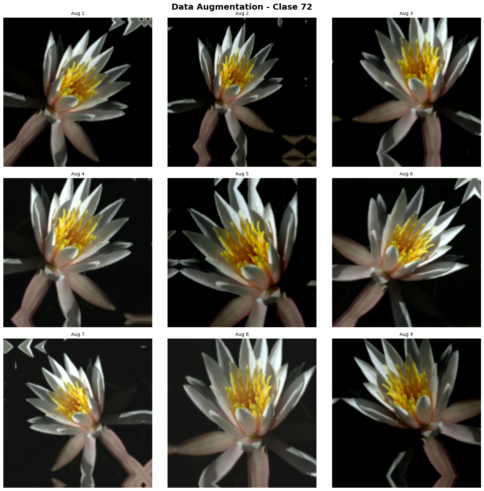
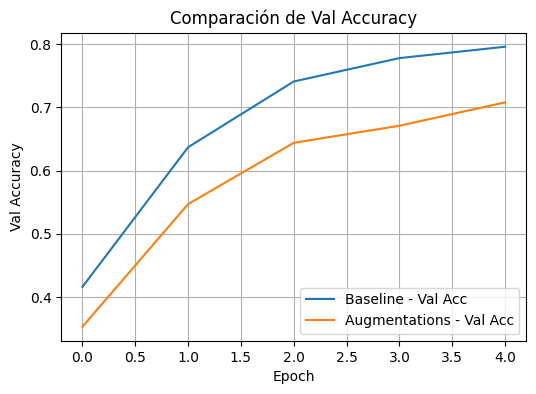
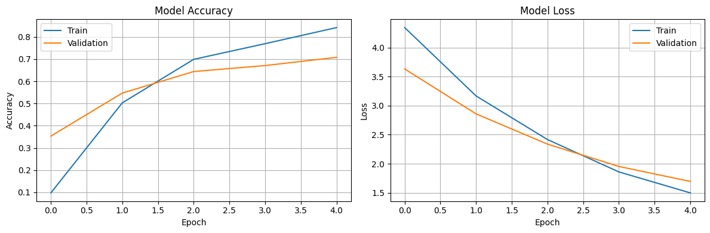
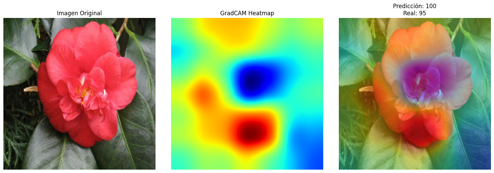
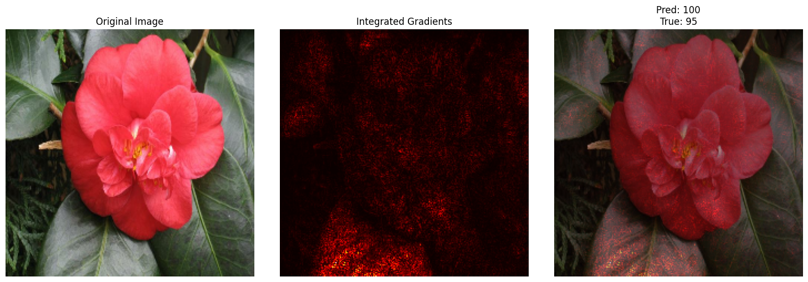

# Data Augmentation Avanzado & Explicabilidad (UT3‑10)

- Consigna: [`Practica 10`](https://juanfkurucz.com/ucu-ia/ut3/10-data-augmentation-xai-assignment/)
- Trabajo realizado (notebook): [`ut3_2.ipynb`](https://colab.research.google.com/drive/1cPgsHClt35R-MloEwGH5fUF1aML02ev-?usp=sharing)

## Contexto

Aplicación móvil para **identificación de flores**: robustez ante variaciones de captura y **explicabilidad** de predicciones. Se hace uso del Dataset **Oxford Flowers102** con 102 especies, imágenes RGB de alta resolución y distribución desbalanceada.
Se entrena un modelo con **data augmentation avanzado** y se explican sus decisiones con **GradCAM** e **Integrated Gradients**.

### Qué se quiso comprobar

- Si un **pipeline de augmentations realistas** (flip horiz., rotaciones moderadas, zoom/traslación, brillo/contraste) mejora la **generalización** respecto de un pipeline baseline sin augmentations.
- Si con una **base preentrenada liviana** (EfficientNetB0) es posible alcanzar un punto dulce entre precisión y costo para un uso móvil.
- Si las técnicas de **XAI** (GradCAM, IG) confirman que el modelo se enfoca en regiones botánicamente relevantes y no en el fondo.

## Objetivos

- Construir _pipelines_ de datos: **baseline** y **augmentation avanzado** (Keras preprocessing layers).
- Entrenar un modelo **transfer learning** (base EfficientNetB0; entrada 224px) y evaluar su **robustez**.
- Implementar **GradCAM** e **Integrated Gradients** para explicabilidad.
- Documentar **resultados, visualizaciones y conclusiones** con foco en utilidad práctica.

## Actividades (con tiempos estimados)

| Actividad                                        | Tiempo | Resultado esperado                              |
| ------------------------------------------------ | :----: | ----------------------------------------------- |
| Carga y _preprocess_ (TFDS Flowers102)           |  30m   | Tensores a 224×224 y _splits_                   |
| Pipeline baseline (+ normalización EfficientNet) |  25m   | Dataloaders `train_baseline` y `test_baseline`  |
| Pipeline con augmentation avanzado               |  30m   | `train_augmented` con flips/rot/zoom/brightness |
| Entrenamiento (TL) y _early stopping_            |  45m   | `history` con métricas y mejor `val_accuracy`   |
| Explicabilidad (GradCAM + IG)                    |  30m   | Heatmaps y _overlays_ interpretables            |

## Desarrollo y decisiones

### Datos y _setup_

- **TFDS:** `oxford_flowers102` con _subset_ opcional para entrenamiento rápido (p.ej., 5 000/1 000).
- **IMG_SIZE:** 224, **NUM_CLASSES:** 102, **BATCH_SIZE:** 32/64.
- **Normalización:** `keras.applications.efficientnet.preprocess_input`.
- **Reproducibilidad:** `seed=42`.
- **Augmentations** (Keras): Flip `horizontal`, Rotación `0.125`, Zoom `0.2`, Traslación `[(0.1,0.1)]`, Brillo `[0.2]`, Contraste `0.2`.

Racional de augmentations:

- Mantener las **transformaciones dentro de rangos suaves** para no distorsionar especies (evitar rotaciones completas o recortes severos que eliminen pétalos/centro).
- Brillo/contraste moderados para simular **condiciones de luz variadas** típicas de fotos móviles.
- Traslaciones y zoom para tolerar **encuadres inestables**.

### Modelo y entrenamiento

- **Base TL:** EfficientNetB0, `include_top=False`, `weights='imagenet'`; _head_ `GlobalAveragePooling2D → Dense(NUM_CLASSES, softmax)`.
- **Estrategia:** entreno **congelado** (rápido) y opción de **fine‑tuning** parcial (LR bajo, p.ej. 1e‑4).
- **Hiperparámetros:** `optimizer='adam'`, `epochs=5`, _early stopping_ en `val_accuracy`.

Metodología de entrenamiento/evaluación:

- Se entrena en dos configuraciones: **baseline** (sin aug) y **aug avanzado**, manteniendo la misma arquitectura y _early stopping_ para una comparación justa.
- Se usan **_splits_ fijos** para evitar fuga de datos entre entrenamiento y validación.
- Se reporta **mejor `val_accuracy`** y métricas en **test** sin augmentations, para medir performance realista.

Contrato del sistema (resumido):

- Input: imagen RGB 224×224 (preprocesada con `efficientnet.preprocess_input`).
- Output: vector de 102 probabilidades (softmax); clase = `argmax`.
- Éxito: `val_accuracy` ≥ 70% con augmentations y atención visual en regiones florales.

## Resultados

### Métricas principales (resumen)

- Mejor precisión en validación: **70.80%**
- Precisión en test: **70.70%**
- Pérdida en test: **1.7002**

Notas rápidas:

- Entrenamiento con base EfficientNetB0, _head_ GAP → Dense(102), normalización específica de la base.
- Augmentation activado durante _train_; evaluación en _test_ sin transforms.

### Visualizaciones y evidencias

- Ejemplos de Data Augmentation (9‑grid):
  
- Comparación de precisión en validación (baseline vs augmentation):
  
- Evaluación del modelo:
  

## Explicabilidad

### GradCAM

- Última capa conv detectada: `top_conv` (en EfficientNetB0).
- Evidencia (aplicación sobre una imagen de test):
  

Cómo se implementó:

1. Se obtiene la activación de `top_conv` y el gradiente de la salida para la clase objetivo respecto a esas activaciones.
2. Se promedian los gradientes por canal para obtener **pesos** $w_k$.
3. Se combina el mapa de activación por canal con los pesos y se aplica ReLU: $\mathrm{GradCAM} = \mathrm{ReLU}\big(\sum_k w_k A^k\big)$.
4. Se reescala al tamaño de la imagen y se superpone con un colormap semitransparente.

**Posible corrección:** si el modelo acierta y atiende a pétalos/centro/estambres, es una señal de confianza; si mira fondo o _artefactos_, revisar el _bias_ y _augmentation_.

### Integrated Gradients

- Steps: 50 (sugerido para un equilibrio tiempo/estabilidad).
- Evidencia (atribuciones y _overlay_):
  

Cómo se implementó:

1. Se define una **imagen base** (negra o desenfocada) y se interpola en `N=50` pasos hasta la imagen real.
2. En cada paso se calcula el **gradiente de la probabilidad de la clase** con respecto a los píxeles de entrada.
3. Se promedia el gradiente a lo largo del camino y se multiplica por la diferencia `imagen − base` para obtener la **atribución** por píxel.
4. Se normaliza y se visualiza como mapa de calor y como _overlay_.

## Reflexión

- **Impacto del augmentation:** en la figura de comparación se muestra un **desplazamiento sostenido** de la curva de validación a favor del pipeline con augmentations y menor varianza entre épocas; esto sugiere mejor capacidad de generalización.
- **GradCAM/IG:** en los ejemplos adjuntos, la atención se concentra sobre **pétalos y estructuras centrales**, lo que respalda que el modelo aprende señales relacionadas a las flores y no de el fondo; en los errores, la atención se dispersa hacia hojas/fondo.
- **Errores típicos:** especies visualmente cercanas (colores y formas similares) y tomas con **oclusiones**; para solucionarlo, podría ayudar **class weights**, **más datos por clase** o **augmentations específicos** (p.ej., color jitter más amplio).
- **Próximos pasos:** ampliar épocas con **fine‑tuning** parcial, probar **Mixup/CutMix** y **TTA**, y medir **tiempo/época** y **tamaño del modelo** para el caso móvil.

## Referencias

- Consigna: [`Practica 10`](https://juanfkurucz.com/ucu-ia/ut3/10-data-augmentation-xai-assignment/)
- Trabajo realizado (notebook): [`ut3_2.ipynb`](https://colab.research.google.com/drive/1cPgsHClt35R-MloEwGH5fUF1aML02ev-?usp=sharing)
- Documentación de **Keras/TensorFlow** para _preprocessing layers_, GradCAM e Integrated Gradients.
