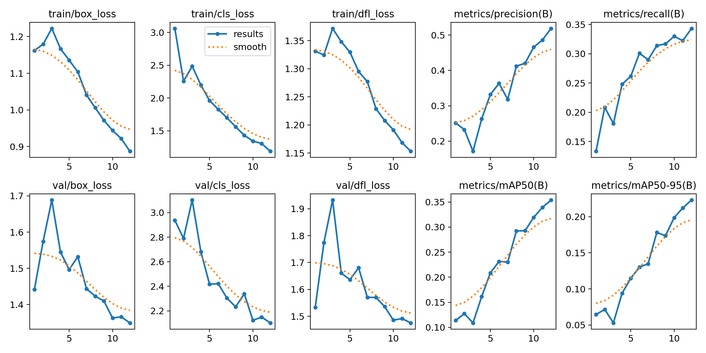
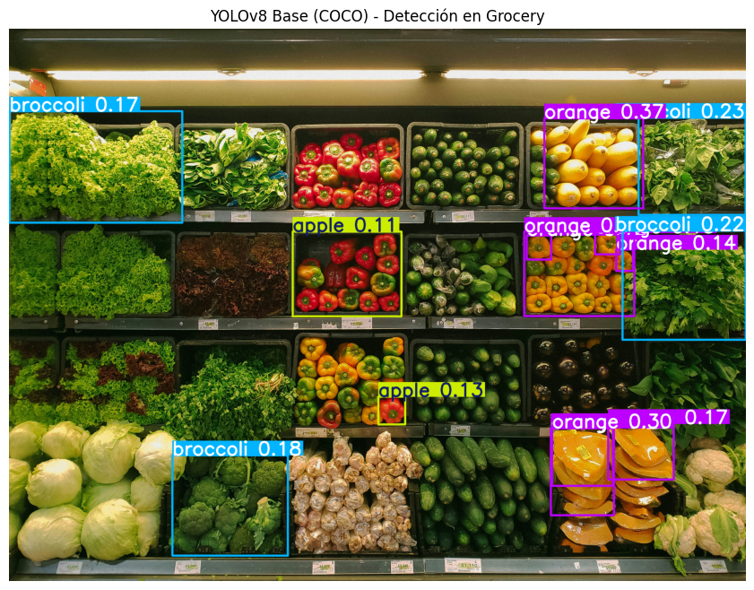
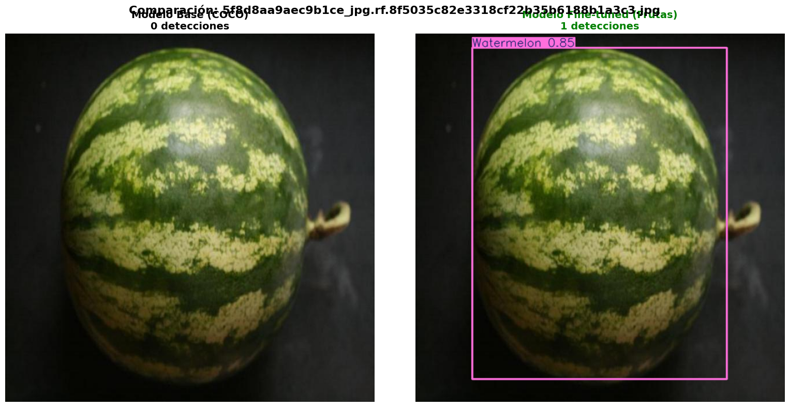
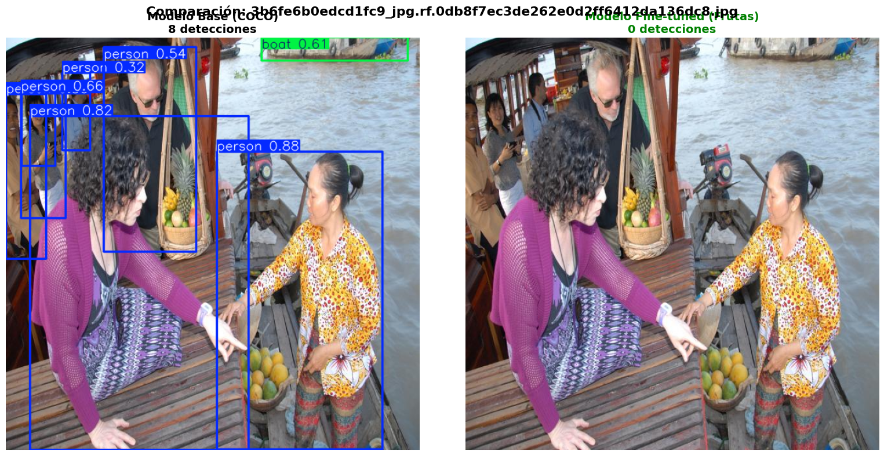
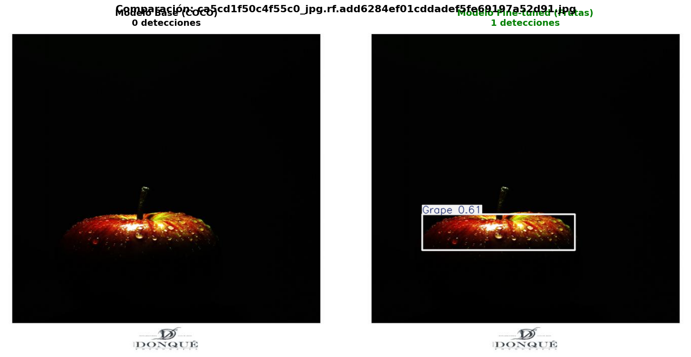
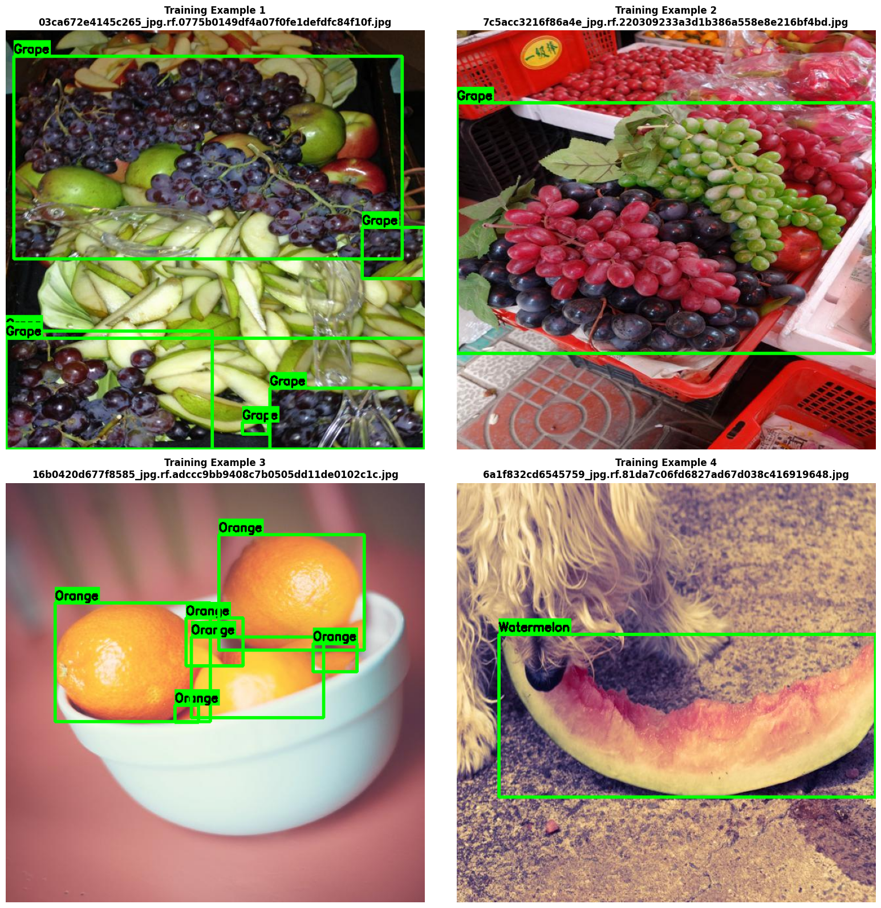
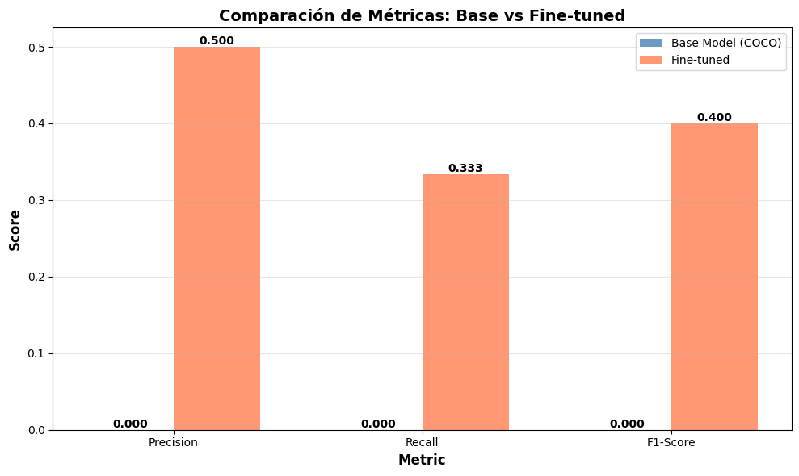
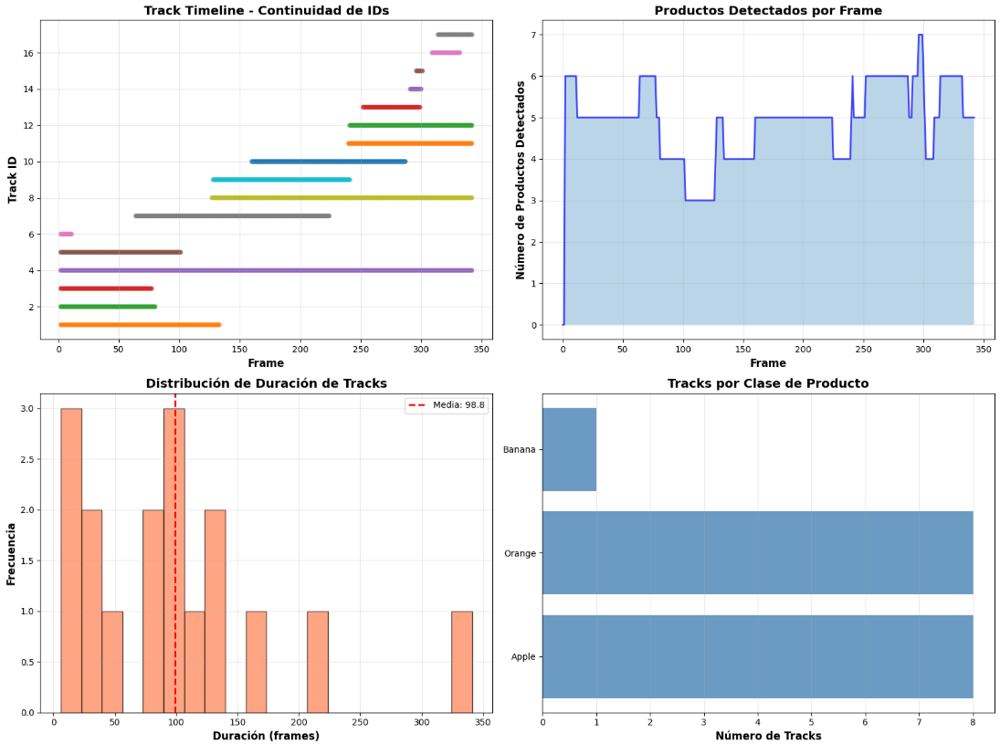

# Detección de Frutas con YOLOv8 + Tracking (UT3‑11)

- Consigna: [`Practica 11`](https://juanfkurucz.com/ucu-ia/ut3/11-object-detection-assignment/)
- Trabajo realizado (notebook): [`ut3_3.ipynb`](https://colab.research.google.com/drive/1f0jwT-xq4i9XJIWCdOH4FuJXW769MxkK?usp=sharing)

## Contexto

Caso de uso de retail/grocery: detección de frutas en góndola y conteo/seguimiento en video. Se parte de un modelo **YOLOv8n** preentrenado en **COCO** y se realiza **fine‑tuning** sobre un dataset específico de frutas (formato YOLO). Finalmente se integra un **tracker** (Norfair) para mantener IDs consistentes a lo largo de un video.

### Qué se quiso comprobar

- Cómo se comporta el modelo base de COCO en un pasillo de supermercado (detecciones genéricas vs. específicas).
- El impacto del **fine‑tuning** con clases explícitas de frutas (Apple, Banana, Grape, Orange, Pineapple, Watermelon).
- La mejora cuantitativa frente al modelo base y la estabilidad de **tracking** en video.

## Objetivos

- Preparar y verificar un dataset de frutas en formato YOLO.
- Entrenar mediante **transfer learning** un YOLOv8n especializado en frutas.
- Comparar **Base (COCO)** vs **Fine‑tuned** en el mismo conjunto de imágenes y con métricas equivalentes.
- Integrar **Norfair** para seguimiento por ID en video y reportar estadísticas de tracking.

## Actividades (con tiempos estimados)

| Actividad                                                | Tiempo | Resultado esperado                                    |
| -------------------------------------------------------- | :----: | ----------------------------------------------------- |
| Descarga/verificación del dataset (YOLO)                 |  25m   | `data.yaml` correcto y rutas consistentes             |
| Exploración y visualización de la distribución de clases |  20m   | Gráfico de desbalanceo y estadísticas por clase       |
| Fine‑tuning de YOLOv8n                                   |  40m   | `results.png`, `best.pt` y logs de entrenamiento      |
| Comparación Base vs Fine‑tuned                           |  25m   | Figuras comparativas y métricas (Precision/Recall/F1) |
| Tracking en video con Norfair                            |  30m   | Video anotado + métricas de continuidad de IDs        |

## Desarrollo y decisiones

### Datos y setup

- Dataset: “Fruit Detection Dataset” (Kaggle), formato YOLO.
- Clases: `['Apple', 'Banana', 'Grape', 'Orange', 'Pineapple', 'Watermelon']`.
- Distribución en entrenamiento (conteo exacto obtenido del notebook):
  - Apple: **6070**
  - Banana: **2971**
  - Grape: **6027**
  - Orange: **13938**
  - Pineapple: **1372**
  - Watermelon: **1683**
  - Total instancias: **32061** (promedio por clase: **5343.5**)
  - Más frecuente: **Orange (13938)**; menos frecuente: **Pineapple (1372)**.

Evidencia de distribución de clases:

### Modelo y entrenamiento

- Base: **YOLOv8n** (`yolov8n.pt`).
- Hiperparámetros usados en el notebook:
  - Epochs: **12**
  - Batch size: **16**
  - Image size: **640**
  - Fraction del dataset para rapidez: **0.25**
- Umbrales de inferencia:
  - Comparaciones en validación: `conf = 0.3`.
  - Tracking en video: `conf = 0.1` (favorece continuidad, menos “parpadeos”).

Salida del entrenamiento (resumen de `results.png`):

### Detección con modelo base (COCO)

Se probó el modelo base sobre una imagen de góndola. Obteniendo los siguientes resultados:

- Objetos detectados: **14**
- Clases detectadas (ejemplos) y confidencias: mayormente `orange` y `broccoli`, teniendo `apple` una confianza menor.

Evidencia:

Conclusión rápida: el modelo base reconoce clases genéricas de COCO y no productos específicos de grocery; por eso aparecen detecciones como “broccoli” aunque el interés sea distinguir frutas particulares.

## Resultados

### Comparativas Base vs Fine‑tuned

Se evaluaron ambos modelos sobre las mismas imágenes del validation set. Detecciones y visualizaciones lado a lado:

Adicionalmente, se visualizaron ejemplos de entrenamiento con sus anotaciones:

### Métricas principales (cálculo sobre el subset analizado)

- Modelo Base (COCO): **TP 0**, **FP 3**, **FN 5** → Precision **0.000**, Recall **0.000**, F1 **0.000**.
- Modelo Fine‑tuned: **TP 4**, **FP 2**, **FN 1** → Precision **0.667**, Recall **0.800**, F1 **0.727**.
- Mejora: Precision **+0.667**, Recall **+0.800**, ΔF1 **+0.727**.

Evidencia:

Interpretación:

- El fine‑tuning aporta una ganancia clara en todas las métricas frente al modelo genérico.
- El desbalanceo (clase Orange muy dominante) sugiere priorizar recolección de **Pineapple** y **Watermelon** para mejorar recall en clases minoritarias.

## Tracking en video

Se descargó un video de frutas en cinta transportadora y se procesó con el modelo fine‑tuned + **Norfair**.

- Propiedades del video: **FPS 29.97**, **343 frames**, **768×432**, **11.4 s**.
- Métricas de calidad del tracking (desde el notebook):
  - Tracks totales: **17**
  - Tracks cortos (<1 s): **5** (**29.4%**)
  - Tracks largos (>3 s): **9** (**52.9%**)

Evidencias y gráficos de seguimiento:

Notas:

- Con `conf=0.1` se prioriza continuidad de IDs. Subir el umbral reduce falsos positivos pero puede aumentar **ID switches** o pérdidas momentáneas.
- Parámetros relevantes de Norfair utilizados: `distance_function = mean_euclidean`, `distance_threshold = 100`, `hit_counter_max = 30`, `initialization_delay = 2`.

## Reflexión

- El **fine‑tuning** sobre un dataset específico cambió el modelo de “genérico” a **especialista** en frutas, mejorando sensiblemente Precision/Recall/F1 en el subset evaluado.
- El **desbalanceo** de clases (Orange ≫ Pineapple/Watermelon) puede sesgar el entrenamiento. Para lo cual se sugiere:
  - Aumentar datos de clases minoritarias (data collection o **augmentation** específico).
  - Usar `class_weights` o estrategias de muestreo balanceado.
- Para **tracking**, los resultados muestran continuidad razonable de IDs y buena proporción de tracks largos. Para producción se puede:
  - Ajustar `distance_threshold` y el umbral de confianza para el contexto/cámara.
  - Considerar suavizado temporal (Kalman) o trackers basados en apariencia (DeepSORT) si hay oclusiones.

## Referencias

- Consigna: [`Practica 11`](https://juanfkurucz.com/ucu-ia/ut3/11-object-detection-assignment/)
- Trabajo realizado (notebook): [`ut3_3.ipynb`](https://colab.research.google.com/drive/1f0jwT-xq4i9XJIWCdOH4FuJXW769MxkK?usp=sharing)
- Ultralytics YOLOv8 y Norfair (documentación oficial)
