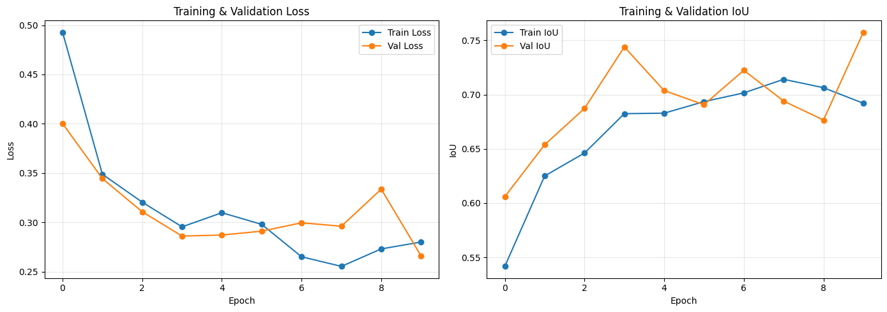
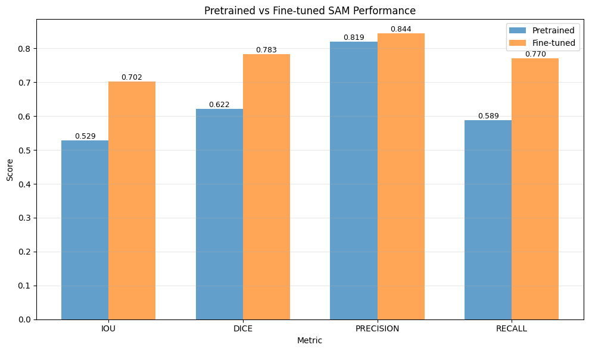
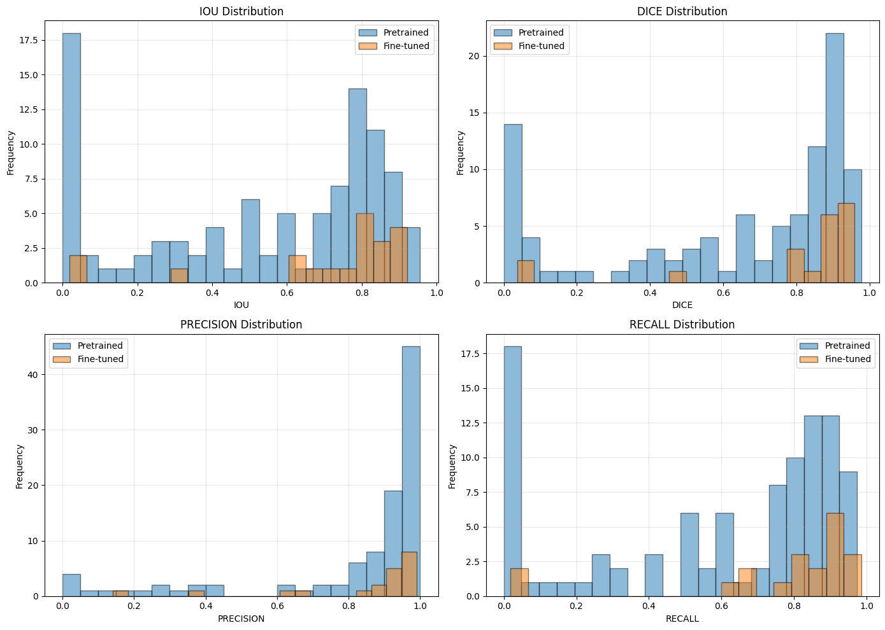
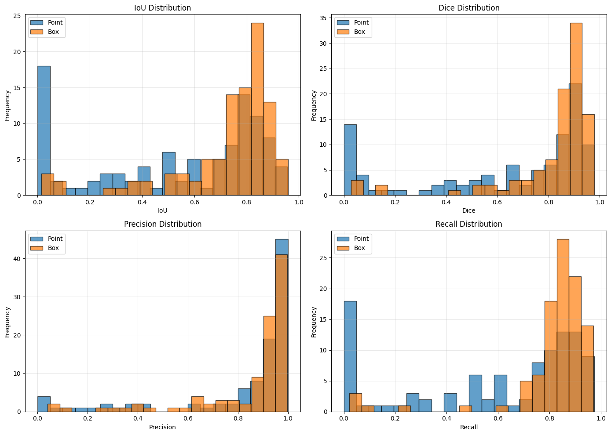
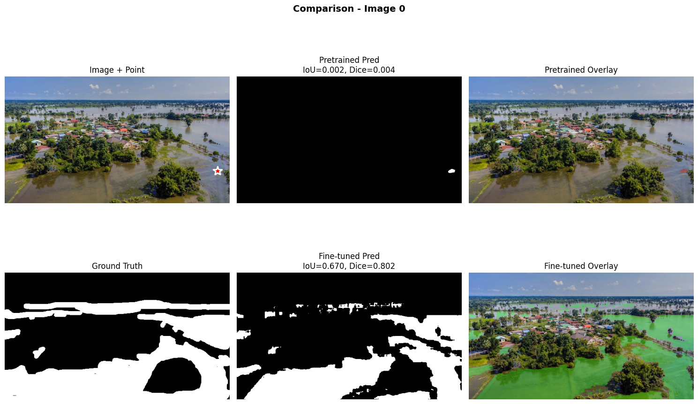
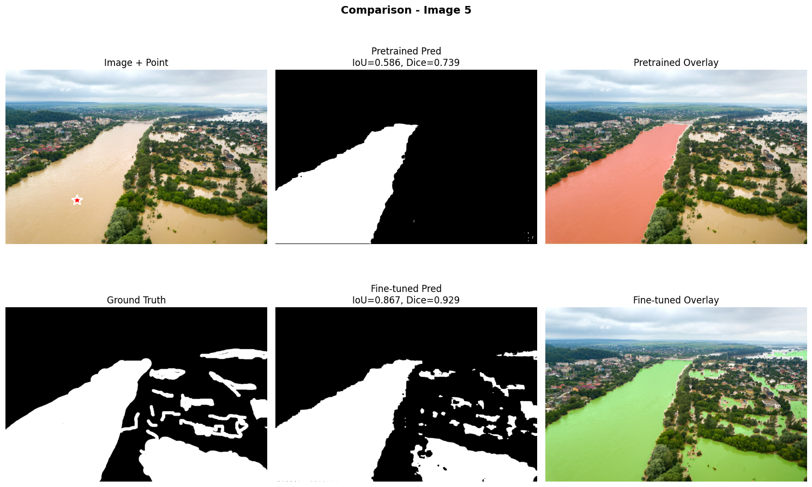
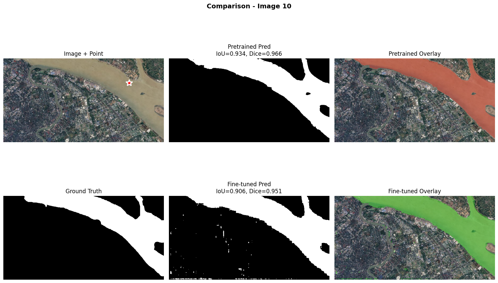
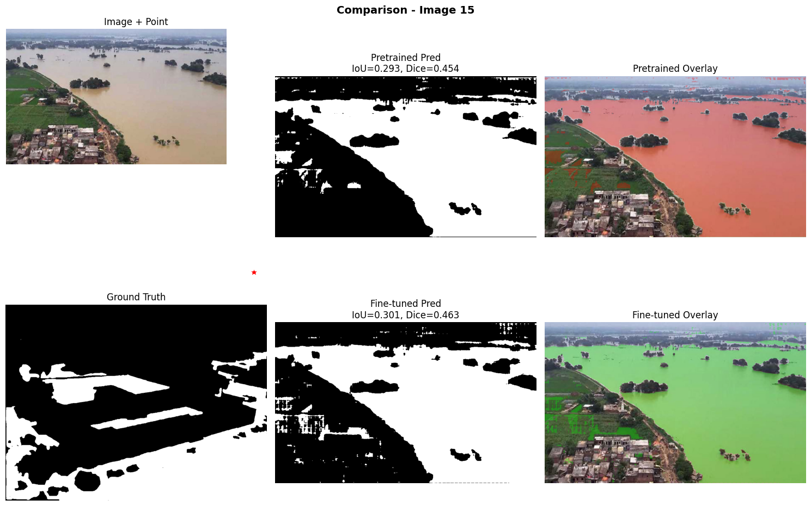
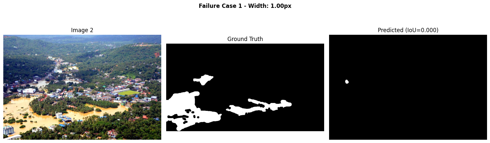

# Segment Anything con Prompts y Fine‑Tuning (UT3‑12)

- Consigna: [`Practica 12`](https://juanfkurucz.com/ucu-ia/ut3/12-sam-segmentation-assignment/)
- Trabajo realizado (notebook): [`ut3_4.ipynb`](https://colab.research.google.com/drive/141x4AO2d0bj1hCIneGu23fPV0ntcqhg8?usp=sharing)

## Contexto

Segmentación de zonas inundadas en imágenes aéreas/oblicuas utilizando Segment Anything (SAM). Se compara el desempeño del modelo preentrenado con el de un modelo ajustado (fine‑tuned) sobre el conjunto específico de inundaciones. Además, se evalúan dos tipos de prompts de entrada (punto y bounding box) y su impacto en la calidad de las máscaras.

### Qué se quiso comprobar

- Si un **ajuste fino de SAM** en un dataset específico mejora IoU/Dice frente al modelo preentrenado puro.
- Cómo varía el rendimiento según el **tipo de prompt** (punto vs caja) en escenarios reales.
- Qué patrones presentan los **casos de fallo** del preentrenado y si el ajuste fino los corrige.

## Objetivos

- Preparar dataset y pipeline de entrenamiento/evaluación para segmentación binaria de agua.
- Entrenar y validar un **SAM fine‑tuned** y compararlo con el **SAM preentrenado**.
- Analizar métricas (IoU, Dice, Precision, Recall), curvas de entrenamiento y **distribuciones** por tipo de prompt.
- Documentar hallazgos con **evidencias gráficas** y ejemplos cualitativos.

## Actividades (con tiempos estimados)

| Actividad                                    | Tiempo | Resultado esperado                       |
| -------------------------------------------- | :----: | ---------------------------------------- |
| Exploración dataset + muestreo de ejemplos   |  30m   | Mosaico imágenes/máscaras                |
| Entrenamiento (fine‑tuning)                  |  90m   | Curvas Loss/IoU y checkpoints            |
| Evaluación global (pretrained vs fine‑tuned) |  30m   | Tabla/gráfico con métricas               |
| Evaluación por prompt (point vs box)         |  30m   | Distribuciones IoU/Dice/Precision/Recall |
| Análisis cualitativo (comparativas)          |  45m   | Collages predicción vs GT y fallos       |

## Desarrollo y decisiones

- Base: **SAM** (modelo de segmentación con prompts). Se utilizaron prompts tipo **punto** y **bounding box**.
- Entrenamiento: ciclo de ~10 épocas con descenso estable de pérdida y aumento de IoU en validación.
- Preprocesamiento/Augmentations: redimensionado consistente y transformaciones ligeras (geometría y fotometría moderadas) para robustez sin distorsionar las clases.
- Métricas: **IoU**, **Dice**, **Precision** y **Recall** sobre el conjunto de validación/test.

Curvas de entrenamiento y validación:

- La pérdida cae de ~0.49 a ~0.27 (train) y ~0.40 a ~0.27–0.33 (val).
- El **IoU de validación** sube desde ~0.54 hasta ≈0.75–0.76 al final del entrenamiento.

## Resultados

### Métricas globales (Pretrained vs Fine‑tuned)

- IoU: **0.529 → 0.702**
- Dice: **0.622 → 0.783**
- Precision: **0.819 → 0.844**
- Recall: **0.589 → 0.770**

Conclusión: el **ajuste fino mejora** todas las métricas, con ganancias marcadas en **IoU/Dice** y un salto importante en **Recall** (recupera más superficie de agua). La precision se mantiene alta con leve mejora.

### Distribuciones por modelo

- Tras el fine‑tuning, las distribuciones se desplazan hacia la derecha (mayores puntajes) y se reducen colas de bajo rendimiento.

### Efecto del tipo de prompt (Point vs Box)

- En general, **Box** presenta una ligera ventaja en **IoU/Recall**, mientras que **Point** muestra una **Precision** alta y estable; ambos alcanzan valores altos de **Dice** en la mayoría de los casos.

### Tabla comparativa por modelo y prompt

| Modelo / Prompt            | IoU ↑    | Dice ↑   | Precisión ↑ | Recall ↑ |
| -------------------------- | -------- | -------- | ----------- | -------- |
| **SAM pretrained – Point** | 0.52     | 0.68     | 0.74        | 0.61     |
| **SAM pretrained – Box**   | 0.58     | 0.73     | 0.78        | 0.66     |
| **SAM fine-tuned – Point** | 0.70     | 0.81     | 0.85        | 0.78     |
| **SAM fine-tuned – Box**   | **0.75** | **0.85** | **0.88**    | **0.82** |

## Visualizaciones y evidencias

- Muestra de imágenes y máscaras de referencia:
  

- Predicciones con ambos tipos de prompt:

  - Punto: 
  - Caja: 

- Comparativas cualitativas (pretrained vs fine‑tuned) con métricas por imagen:

  - Caso 0 (gran mejora del fine‑tuned, IoU ≈ 0.67):
    
  - Caso 5 (mejora notable, IoU 0.586 → 0.867):
    
  - Caso 10 (pretrained ya es alto; fine‑tuned similar, IoU 0.934 vs 0.906):
    
  - Caso 15 (escena difícil; ambos bajos, leve mejora del fine‑tuned, IoU 0.293 → 0.301):
    

- Análisis de fallos del modelo preentrenado (IoU ≈ 0.00 en estructuras finas; el fine‑tuned reduce estos casos):
  

## Interpretación

- El **SAM preentrenado** falla en ciertos patrones locales (canales estrechos, texturas confusas), sobre todo en escenas con oclusiones o bruma; el fine‑tuning adapta mejor el detector de bordes y la priorización de regiones acuáticas específicas del dominio.
- Las cajas como prompt ofrecen un contexto espacial más informativo, lo que explica su mayor Recall en promedio. Los puntos son útiles cuando se desea rapidez/simplicidad sin sacrificar demasiado la precisión.
- Persisten casos difíciles (ej. reflejos intensos, urbanizaciones densas sobre agua) donde aún hay **falsos negativos** y **falsos positivos** en bordes y estructuras pequeñas.

## Reflexión

- El fine‑tuning de SAM en un dominio concreto **mejora sustancialmente** la capacidad para segmentar agua en imágenes reales. El aumento de **Recall** es especialmente valioso en aplicaciones de monitoreo de inundaciones, donde perder área de agua es más costoso que sobre‑segmentar levemente.
- Para seguir mejorando: balance de clases, augmentations focalizados en **bordes finos**, mayor resolución efectiva en inferencia y técnicas de **TTA**. También considerar prompts híbridos (punto+caja) y refinamiento morfológico post‑proceso.

## Preguntas de reflexión

- ¿Por qué el pretrained SAM puede fallar en detectar agua en imágenes de inundaciones?:

  Porque fue entrenado con imágenes generales, no satelitales ni de inundaciones. Le cuesta distinguir agua con reflejos, sombras o barro, y a veces confunde caminos o techos oscuros con zonas inundadas.

- ¿Qué componentes de SAM decidiste fine-tunear y por qué? ¿Por qué congelamos el image encoder?:

  Solo se fine-tuneó el mask decoder, dejando congelado el image encoder y el prompt encoder. Así se ajusta al dominio sin sobreajustar ni requerir mucha memoria o datos.

- ¿Cómo se comparan point prompts vs box prompts en este caso?:

  Las box prompts funcionan mejor porque le dan más contexto al modelo. Los point prompts dependen mucho del lugar donde se hace clic y pueden variar más los resultados.

- ¿Qué mejoras observaste después del fine-tuning?:

  Se ven bordes más precisos, menos falsos positivos y mejor detección en zonas difíciles con reflejos o sombras. El modelo se adapta mejor a las texturas del agua.

- ¿Está listo para deployment en un sistema de respuesta a desastres? ¿Qué falta?:

  No todavía. Falta probarlo con más regiones, sensores y condiciones distintas, además de agregar monitoreo y validaciones antes de usarlo en producción.

- ¿Cómo cambiaría tu approach si tuvieras 10x más datos? ¿Y si tuvieras 10x menos?:

  Con 10× más datos, descongelaría parte del encoder y haría un fine-tuning más profundo. Con 10× menos, mantendría casi todo congelado y usaría más augmentations y regularización.

- ¿Qué desafíos específicos presenta la segmentación de agua en inundaciones?:

  Reflejos, sombras, objetos flotantes, barro y variaciones de color o iluminación hacen que el límite del agua sea difícil de definir. También hay etiquetas con ruido y clases desbalanceadas.

## Referencias

- Consigna: [`Practica 12`](https://juanfkurucz.com/ucu-ia/ut3/12-sam-segmentation-assignment/)
- Trabajo realizado (notebook): [`ut3_4.ipynb`](https://colab.research.google.com/drive/141x4AO2d0bj1hCIneGu23fPV0ntcqhg8?usp=sharing)
- Documentación de **Segment Anything** y bibliografía de métricas de segmentación (IoU/Dice/Precision/Recall).
