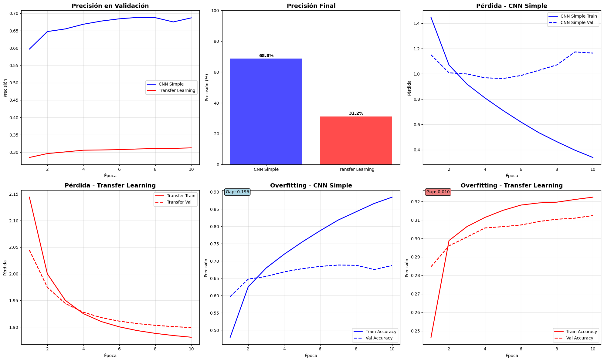

# CNN simple vs Transfer Learning en CIFAR‑10: resultados, overfitting y mejoras (UT3‑9)

- Consigna: [`Practica 9`](https://juanfkurucz.com/ucu-ia/ut3/09-cnn-transfer-learning-assignment/)
- Trabajo realizado (notebook): [`ut3_1.ipynb`](https://colab.research.google.com/drive/1ekqzmlP2GfLRnoQDK15ubWuZf0j6xLuJ?usp=sharing)

## Contexto

Se comparan dos enfoques de visión por computadora en **CIFAR‑10** (10 clases, 32×32×3):

1. una **CNN simple** desde cero, y
2. **Transfer Learning** con una base de _Keras Applications_ (congelada inicialmente).  
   El objetivo es analizar **precisión**, **tamaño del modelo** y **overfitting**, e iterar con mejoras propuestas en el **Paso 7**.

## Objetivos

- Implementar y entrenar una **CNN baseline** y un modelo de **Transfer Learning** en CIFAR‑10.
- Evaluar **accuracy** y **loss** en _test_, e inspeccionar **overfitting** con curvas y _gap_ `train − val`.
- Realizar **investigación libre (Paso 7)**: regularización, _fine‑tuning_ y comparación de bases.
- Documentar decisiones y **evidencias** con foco en visualizaciones.

## Actividades (con tiempos estimados)

| Actividad                                    | Tiempo | Resultado esperado                        |
| -------------------------------------------- | :----: | ----------------------------------------- |
| Preparación de datos (normalización/one‑hot) |  20m   | Tensores listos y verificación de formas  |
| Baseline CNN (modelo + entrenamiento)        |  30m   | Accuracy y curvas train/val               |
| Transfer Learning (modelo + entrenamiento)   |  30m   | Accuracy y curvas train/val               |
| Evaluación y comparación                     |  30m   | Tabla y gráficos de resultados            |
| Paso 7 — Investigación libre                 |  90m   | Configs extra: regularización, FT y bases |

## Desarrollo y decisiones

### Datos y _setup_

- Dataset: **CIFAR‑10** de `keras.datasets.cifar10`, normalizado a `[0,1]`, _one‑hot_ en 10 clases.
- `batch_size=128`, _seed_ fija para reproducibilidad, `EarlyStopping(monitor='val_accuracy', patience=3, restore_best_weights=True)`.
- Métricas e imágenes se guardan para el informe (ver **Evidencias**).

### Modelos

**CNN simple**

- 2 bloques `Conv2D(32) → MaxPool` y `Conv2D(64) → MaxPool`, clasificador `Flatten → Dense(512) → Dense(10, softmax)`.
- Parámetros totales: **2,122,186**.

**Transfer Learning (congelado)**

- Base `MobileNetV2(weights='imagenet', include_top=False, input_shape=(32,32,3))`, top `Flatten → Dense(10, softmax)`.
- Parámetros totales: **2,270,794**, entrenables: **12,810** (base congelada).

### Entrenamiento

- Optimizador **Adam** (`lr=1e‑3` en baseline y TL congelado; `1e‑4` para _fine‑tuning_).
- 10 epochs máx. + parada temprana; _validation_ en `x_test` para comparar con el mismo _split_.

## Resultados

### Métricas globales (test)

| Modelo                             | Acc. Test (%) | Gap Overfitting (max train − max val) |
| ---------------------------------- | :-----------: | :-----------------------------------: |
| CNN simple                         |   **68.81**   |               **0.196**               |
| Transfer Learning (base congelada) |   **31.24**   |               **0.010**               |

> Mejora TL vs. CNN: **-37.57 pp** (en este _run_ el baseline supera al TL congelado).

### Resumen cuantitativo ampliado

| Modelo                             | Parámetros totales | Entrenables | Max Acc. Train | Max Acc. Val | Gap (train−val) | Acc. Test | Tiempo eval. por step |
| ---------------------------------- | -----------------: | ----------: | -------------: | -----------: | --------------: | --------: | --------------------: |
| CNN simple                         |          2,122,186 |   2,122,186 |          0.886 |        0.690 |           0.196 |     0.688 |           ≈ 2 ms/step |
| Transfer Learning (base congelada) |          2,270,794 |      12,810 |          0.322 |        0.312 |           0.010 |     0.312 |          ≈ 14 ms/step |

Notas:

- Los valores de parámetros provienen del `model.summary()` de cada arquitectura en el notebook.
- Las precisiones de train/val corresponden a los picos observados en las curvas; el _gap_ se calcula como `max(train) − max(val)` e ilustra el **overfitting**.
- Los tiempos por _step_ provienen de la evaluación final del notebook (Colab); pueden variar según hardware.

### Reportes de clasificación

Se generaron reportes por clase con `sklearn.metrics.classification_report` para ambos modelos. Para mantener el informe ligero, se referencian como imágenes en **Evidencias**.

### Discusión breve de resultados

- La **CNN simple** generaliza razonablemente para CIFAR‑10 con entradas 32×32 y sin _augmentation_, alcanzando ~69% de precisión en validación/test. El **gap 0.196** evidencia sobreajuste moderado: la red memoriza patrones de _train_ más rápido que los que generaliza.
- El **Transfer Learning** (base congelada con `Flatten`) rinde **31%**. Causas probables: (1) desajuste de escala espacial (muchas _applications_ fueron preentrenadas a 224×224 y en 32×32 la jerarquía de features se degrada), (2) _head_ muy simple (`Flatten → Dense(10)`) en vez de **GlobalAveragePooling**, (3) sin **_fine‑tuning_** de capas superiores ni **data augmentation**.
- En inferencia, el TL medido es ~7× más lento por paso (14 ms vs 2 ms) en este entorno, aunque esto puede invertirse si se habilita _mixed precision_ y se ajusta la base.

## Evidencias

Comparación Final:

- Resultados:
  

## Paso 7 — Investigación libre

Se busca explorar nuevas configuraciones de red y técnicas de mejora, aplicando lo aprendido sobre CNNs y Transfer Learning. El objetivo es evaluar cómo afectan la presición, el overfitting y la capacidad de generalización.

### 1) CNN con Regularización (BatchNorm + Dropout)

- **Motivación:** reducir _overfitting_ y estabilizar el entrenamiento del baseline.
- **Config realizada:** añadido `BatchNormalization()` tras `Conv2D`, `Dropout(0.25–0.5)` en bloques y capa densa; `Adam(lr=5e‑4)`.
- **Evidencia (completar):** ``
- **Resultados:** Acc. test **[72.76]%**, epochs **[10]**.

### 2) _Fine‑tuning_ sobre la base preentrenada

- **Motivación:** Se busca aprovechar más el conocimiento del modelo preentrenado habilitando las últimas capas para ajuste fino.
- **Evidencia (completar):** ``
- **Resultados (completar):** Acc. test **[36.17]%**, epochs **[10]**.

### 3) Comparación de modelos base

- **Motivación:** Evaluar distintas arquitecturas preentrenadas para medir su rendimiento sobre CIFAR-10
- **Modelos:** `ResNet50`, `VGG16`, `VGG19`, `EfficientNetB0`, `EfficientNetB3`, `MobileNetV2`, `MobileNetV3Large`.
- **Criterios:** precisión, tiempo por época y parámetros.
- **Tabla:**

  | Base             | Acc. Test (%) | Epochs |
  | ---------------- | :-----------: | :----: |
  | ResNet50         |   [34.32%]    |  [10]  |
  | VGG16            |   [54.31%]    |  [10]  |
  | VGG19            |   [53.15%]    |  [10]  |
  | EfficientNetB0   |   [12.28%]    |  [10]  |
  | EfficientNetB3   |   [13.15%]    |  [10]  |
  | MobileNetV2      |   [30.21%]    |  [10]  |
  | MobileNetV3Large |   [29.11%]    |  [10]  |

## Reflexión

- **Qué funcionó:** la **CNN simple** ofreció un buen baseline con _accuracy_ en test **≈ 68.81%** y **visualizaciones claras** del _gap_ de generalización.
- **Qué ajustar:** el **TL congelado** con `Flatten` directo rindió **31.24%**; conviene añadir **GlobalAveragePooling** y/o **data augmentation**, y aplicar **fine‑tuning** controlado.
- **Próximos pasos:** ejecutar los 3 experimentos del **Paso 7**, registrar métricas comparables (tabla), y priorizar **bases eficientes** (EfficientNet/MobileNet) en 32×32 para mejor relación precisión‑costo.

## Referencias

- **Consigna UT3‑9**: ver [`Practica 9`](https://juanfkurucz.com/ucu-ia/ut3/09-cnn-transfer-learning-assignment/)
- Notebook base: [`ut3_1.ipynb`](https://colab.research.google.com/drive/1ekqzmlP2GfLRnoQDK15ubWuZf0j6xLuJ?usp=sharing)
- Keras Applications & Optimizers — documentación consultada durante el desarrollo.

---
